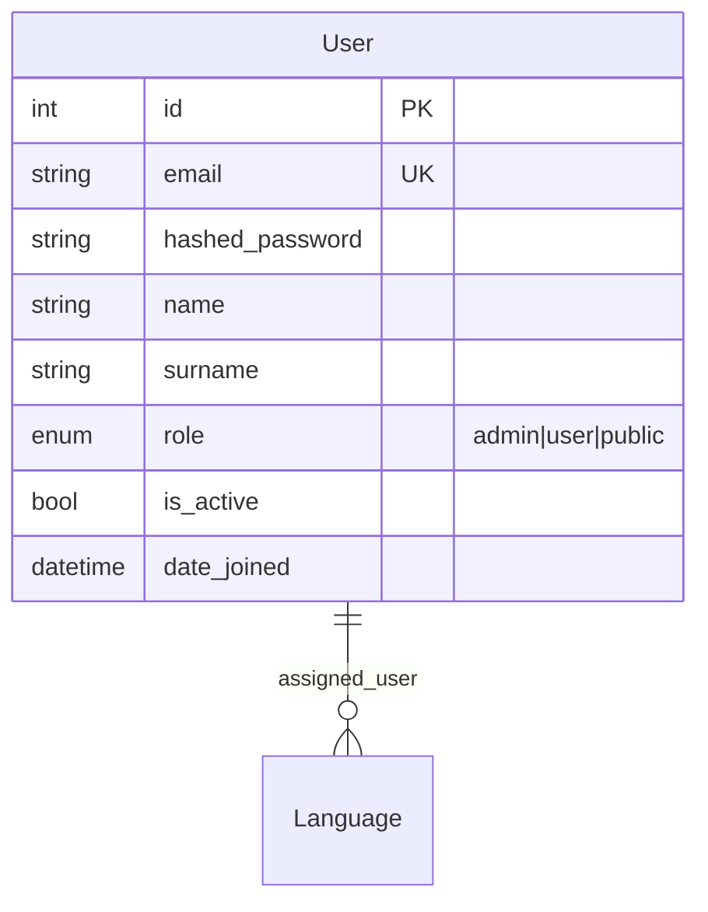
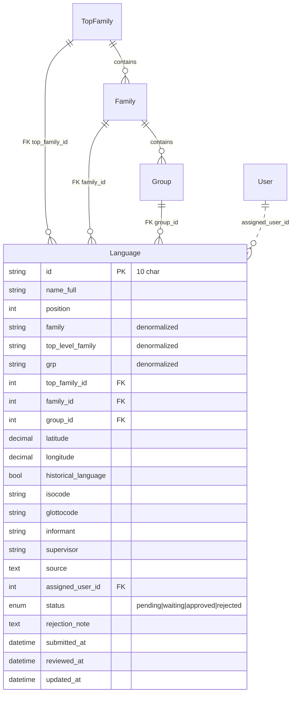
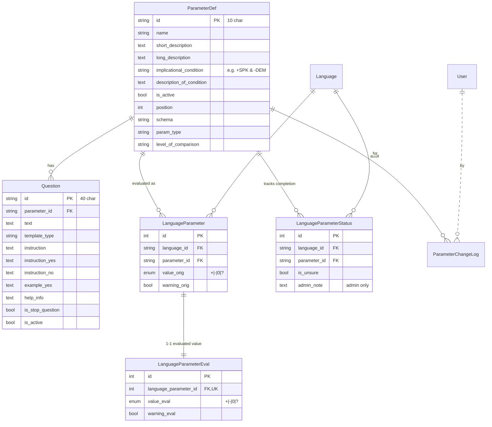
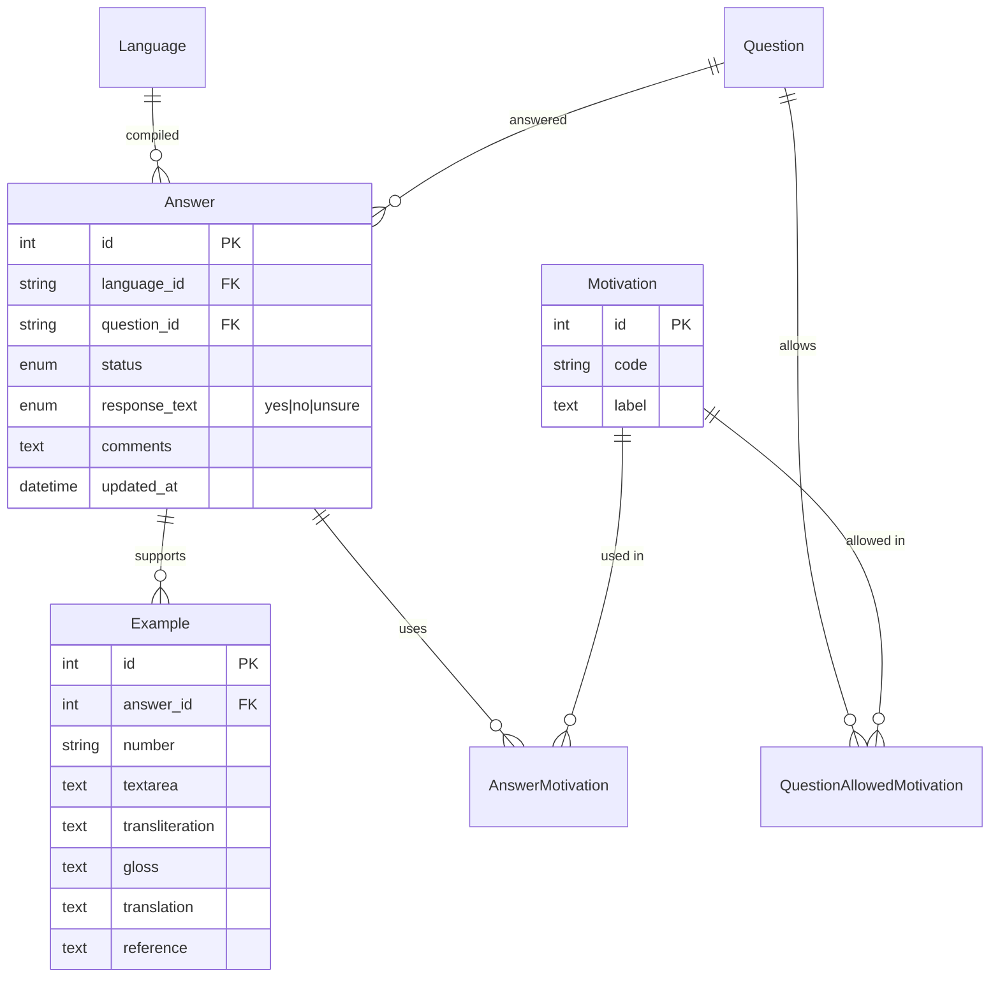
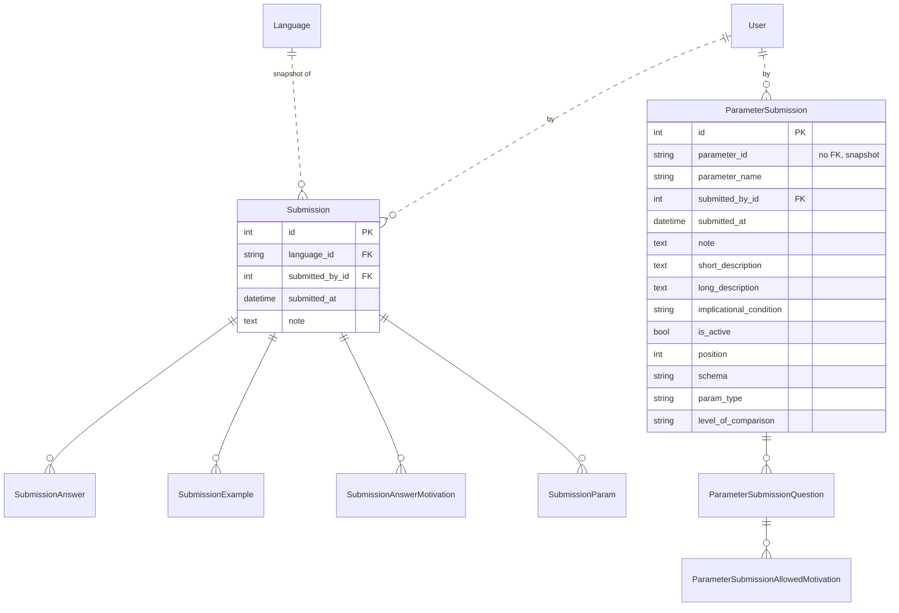
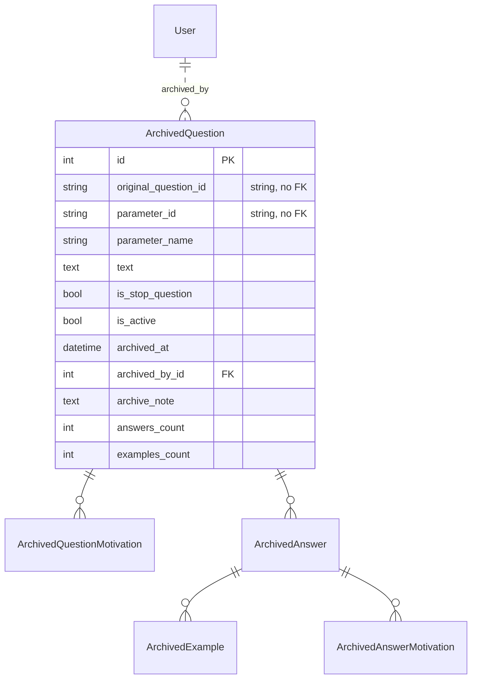
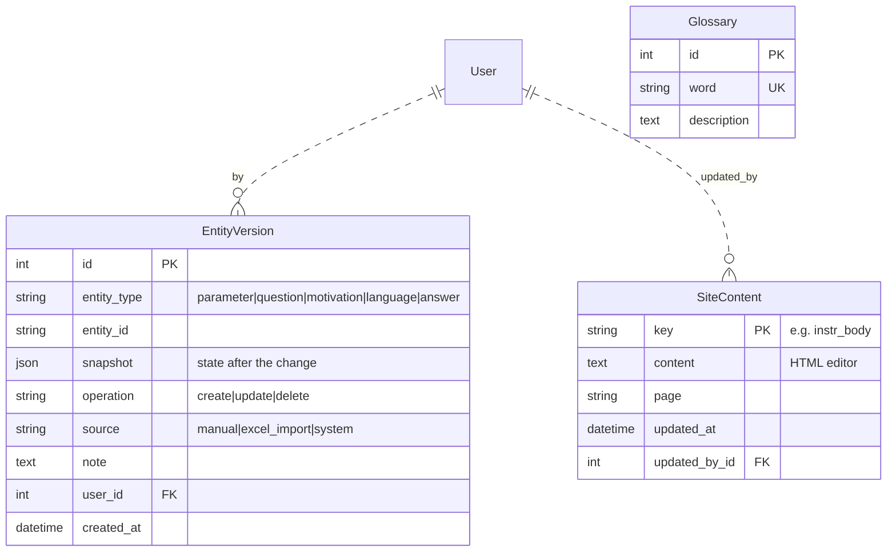

# PCM-Hub — Technical documentation

Reference documentation for developers and maintainers. For end-user usage of the site (linguists/admins) see [user_manual_en.md](docs/user_manual_en.md).

---

## Table of contents

1. [Overview](#1-overview)
2. [Technology stack](#2-technology-stack)
3. [Architecture](#3-architecture)
4. [Development environment setup](#4-development-environment-setup)
5. [Repository layout](#5-repository-layout)
6. [Data model](#6-data-model)
7. [Authentication and authorization](#7-authentication-and-authorization)
8. [API reference](#8-api-reference)
9. [Language compilation workflow](#9-language-compilation-workflow)
10. [Key features](#10-key-features)
11. [Background services and processes](#11-background-services-and-processes)
12. [Frontend SPA](#12-frontend-spa)
13. [Deploy](#13-deploy)
14. [Testing](#14-testing)
15. [Known technical debt](#15-known-technical-debt)

---

## 1. Overview

PCM-Hub is the web application of the **Parametric Comparison Method** (PCM, Longobardi & Guardiano 2009): it collects, organizes and compares syntactic data of natural languages through a set of **universal parameters**. Each language is "compiled" (an assigned linguist answers a set of questions for every parameter) and the app automatically produces comparative matrices, inter-language distances, dendrograms, geographic maps and other analytical outputs.

Three user categories:

- **Public** (anonymous): sees the home page with the interactive language map and the citation guidelines.
- **User** (linguist): compiles the languages they have been assigned to, accesses glossary, instructions, language list.
- **Admin**: manages parameters, questions, motivations, taxonomy, accounts, backups, mass exports, TableA, cross-language analytical queries.

The production instance is hosted at `hub.parametricomparison.unimore.it` on a VM managed via Portainer.

---

## 2. Technology stack

| Layer | Technology | Notes |
|---|---|---|
| Backend | **FastAPI** + Uvicorn | Python 3.x, [backend/main.py](backend/main.py) |
| ORM | **SQLAlchemy 2.x** | [backend/models.py](backend/models.py) |
| DB | **PostgreSQL 16** | Postgres on Alpine, schema managed by Alembic |
| Migrations | **Alembic** | [backend/alembic/](backend/alembic/) |
| Auth | JWT (python-jose) + bcrypt | Bearer token in header, no cookie |
| Rate limiting | **slowapi** | login 5 attempts/min/IP |
| Frontend | **React 18 + Vite + Rolldown** | [frontend/src/](frontend/src/) |
| SPA routing | **react-router-dom v6** | `createBrowserRouter` |
| Maps | **OpenLayers** | OSM tiles |
| WYSIWYG editor | **TinyMCE** | lazy-loaded, admin only |
| Charts/analytics | scipy, numpy, matplotlib, plotly | server-side rendering for exports |
| Reverse proxy + HTTPS | **Caddy 2** | [caddy/Caddyfile](caddy/Caddyfile) |
| Container | Docker Compose | dev: [docker-compose.yml](docker-compose.yml); prod: [docker-compose.prod.yml](docker-compose.prod.yml) |

---

## 3. Architecture

### Runtime view (production)

```
                          Internet
                              │
                       ┌──────┴──────┐
                       │   Caddy 2   │  ← automatic HTTPS via Let's Encrypt
                       │ (ports 80/443) │     gzip, security headers
                       └──┬──────┬───┘
                          │      │
            /api/*, /auth/*│     │/{*}
                          │      │
                ┌─────────▼──┐ ┌─▼─────────────────┐
                │  FastAPI   │ │  React SPA        │
                │  backend   │ │  (frontend_dist)  │
                │  uvicorn   │ │   served by Caddy │
                └─────┬──────┘ └───────────────────┘
                      │
                ┌─────▼──────┐    ┌──────────────────┐
                │ PostgreSQL │    │  pcm_backup      │
                │   16       │◄───┤  pg_dump 1×24h   │
                └────────────┘    └──────────────────┘

Sidecars: pcm_cleaner (daily docker prune)
          pcm_frontend_build (one-shot at deploy: npm ci && npm run build)
```

All services live in named Docker volumes: `postgres_data`, `caddy_data`, `caddy_config`, `frontend_dist`, `pcm_backups`. See [DEPLOY_NOTES.txt](DEPLOY_NOTES.txt) §1, §4.

### Logical view (backend components)

```
backend/
├── main.py              ← FastAPI app, CORS, rate limiter, lifespan, router include
├── config.py            ← env vars, fail-fast in prod
├── auth.py              ← bcrypt + JWT helpers
├── dependencies.py      ← get_db, get_current_user, require_admin
├── database.py          ← create_engine, SessionLocal
├── models.py            ← ALL SQLAlchemy models
├── time_utils.py        ← utc_now() naive UTC
├── rate_limit.py        ← shared slowapi limiter
├── routers/             ← one file per functional area (see §8)
└── services/            ← complex logic outside routers (DAG, export, etc.)
```

The **routers** delegate business logic to [backend/services/](backend/services/) to keep endpoints thin. Examples:

- `services/dag_eval.py` — runs the implicational DAG of parameters for a language
- `services/recompute.py` — recomputes `value_orig`/`value_eval` of a parameter across all languages
- `services/excel_import.py`, `services/excel_export.py` — Excel round-trip
- `services/backup_service.py`, `services/parameter_backup_service.py` — language and parameter snapshots
- `services/migration_import.py` — ZIP bundle import from the legacy site
- `services/versioning.py` — records `EntityVersion` for audit

---

## 4. Development environment setup

### Prerequisites

- Docker Desktop (with Compose v2)
- Git
- For code editing: any editor (VS Code recommended)

### First start

```powershell
git clone <repo-url> pcm-hub
cd pcm-hub
copy .env.example .env
# Edit .env if needed (defaults work for dev)
docker compose up -d
docker compose exec backend alembic upgrade head
```

On first boot, [services/admin_bootstrap.py](backend/services/admin_bootstrap.py) automatically creates an admin account with `ADMIN_EMAIL`/`ADMIN_PASSWORD` (dev defaults: `admin@local`/`admin`).

URLs:

- Vite dev frontend: <http://localhost:5173>
- FastAPI backend: <http://localhost:8000>
- Swagger UI (dev only): <http://localhost:8000/docs>
- Postgres DB from host: `127.0.0.1:5433` (user/password from `.env`)

### Hot reload

- Backend: `uvicorn --reload` restarts on Python file change (volume bind-mount `./backend:/app`).
- Frontend: Vite HMR.

### Common pitfall (`node_modules` out of sync)

The `pcm_frontend` container has an anonymous volume that masks `/app/node_modules`. If you add a dependency to `package.json` you won't find it inside the container the first time. Fix:

```powershell
docker compose exec frontend npm ci
```

This does **not** happen in **prod**: `frontend_build` always starts from scratch with `npm ci`.

### Environment variables (see [backend/config.py](backend/config.py))

| Var | Dev default | Prod | Notes |
|---|---|---|---|
| `ENV` | `dev` | `prod` | enables fail-fast |
| `SECRET_KEY` | `dev-insecure-change-me` | required | JWT signing |
| `ACCESS_TOKEN_EXPIRE_MINUTES` | `30` | `30` | token expiration |
| `ADMIN_EMAIL` / `ADMIN_PASSWORD` | `admin@local` / `admin` | required | first-admin bootstrap |
| `POSTGRES_*` | `pcm_user`/`pcm_password`/`pcm_hub` | required | DB credentials |
| `DATABASE_URL` | derived | explicit | full URL override |
| `CORS_ORIGINS` | `http://localhost:5173,...` | prod domain | CORS whitelist, no wildcard |

In prod: SECRET_KEY, ADMIN_EMAIL, ADMIN_PASSWORD are mandatory. Without them, the app **does not start** (see [config.py](backend/config.py) §Auth/JWT, §Bootstrap admin).

---

## 5. Repository layout

```
pcm-hub/
├── backend/                 ← FastAPI + SQLAlchemy + Alembic
│   ├── alembic/             ← versioned migrations
│   ├── routers/             ← endpoints by functional area (see §8)
│   ├── services/            ← complex logic (DAG, export, backup, etc.)
│   ├── tests/               ← pytest + in-memory SQLite
│   ├── main.py
│   ├── config.py
│   ├── auth.py
│   ├── dependencies.py
│   ├── database.py
│   ├── models.py
│   ├── rate_limit.py
│   ├── time_utils.py
│   ├── requirements.txt
│   └── Dockerfile
├── frontend/                ← React 18 + Vite
│   ├── src/
│   │   ├── api.js           ← centralized axios client
│   │   ├── App.jsx          ← createBrowserRouter
│   │   ├── main.jsx
│   │   ├── context/
│   │   │   └── AuthContext.jsx
│   │   ├── components/      ← Layout, AdminRoute, Drawer, etc.
│   │   ├── features/        ← one subdir per functional area
│   │   │   ├── auth/
│   │   │   ├── public/
│   │   │   ├── dashboard/
│   │   │   ├── languages/
│   │   │   ├── compilation/
│   │   │   ├── parameters/
│   │   │   ├── questions/
│   │   │   ├── motivations/
│   │   │   ├── glossary/
│   │   │   ├── instructions/
│   │   │   ├── tablea/
│   │   │   ├── queries/
│   │   │   ├── accounts/
│   │   │   ├── taxonomy/
│   │   │   ├── history/
│   │   │   ├── backups/
│   │   │   └── admin/       ← Migration, BackupRestore, ImportExcel
│   │   └── utils/           ← shared helpers (search, dateFormat, etc.)
│   ├── public/              ← favicon, info PDFs, static assets
│   ├── package.json
│   └── Dockerfile
├── caddy/
│   └── Caddyfile            ← reverse proxy + Let's Encrypt HTTPS
├── docker-compose.yml       ← dev stack
├── docker-compose.prod.yml  ← prod stack (Portainer)
├── DEPLOY_NOTES.txt         ← architectural deploy notes
├── DEPLOY_PROCEDURA.txt     ← click-by-click deploy checklist
├── .env.example             ← env template
└── docs/                    ← (this folder)
    ├── documentation_it.md
    ├── documentation_en.md  ← (this file)
    ├── manuale_utente_it.md
    └── user_manual_en.md
```

---

## 6. Data model

> ⚠ The **source of truth** for the models is always [backend/models.py](backend/models.py). This chapter is a map to navigate the schema, not a field-by-field reference that would inevitably go out-of-sync. The Alembic migrations in [backend/alembic/versions/](backend/alembic/versions/) freeze the DDL actually applied.

### 6.1 Family map

The 27 models are grouped into 7 logical families:

| Family | Scope | Models |
|---|---|---|
| **Auth & Users** | Identity, roles, assignments | `User` |
| **Languages & Taxonomy** | Languages + hierarchy (top-family > family > group) | `Language`, `TopFamily`, `Family`, `Group` |
| **Parameters & Questions** | Parameter definition, implicational conditions, per-language evaluation | `ParameterDef`, `Question`, `ParamSchema`, `ParamType`, `ParamLevelOfComparison`, `LanguageParameter`, `LanguageParameterEval`, `LanguageParameterStatus`, `ParameterChangeLog` |
| **Answers & Examples** | A linguist's compilation for a language | `Answer`, `Example`, `Motivation`, `QuestionAllowedMotivation`, `AnswerMotivation` |
| **Backup & Submission** | Snapshots of languages (data) and parameters (definitions) | `Submission`, `SubmissionAnswer`, `SubmissionExample`, `SubmissionAnswerMotivation`, `SubmissionParam`, `ParameterSubmission`, `ParameterSubmissionQuestion`, `ParameterSubmissionAllowedMotivation` |
| **Question Archive** | "Retired" questions + frozen related data | `ArchivedQuestion`, `ArchivedQuestionMotivation`, `ArchivedAnswer`, `ArchivedExample`, `ArchivedAnswerMotivation` |
| **History & Site Content** | Audit/diff + dynamic content + glossary | `EntityVersion`, `SiteContent`, `Glossary` |

### 6.2 ER diagrams by family

#### Auth & Users



#### Languages & Taxonomy



#### Parameters & Questions



`ParamSchema`, `ParamType`, `ParamLevelOfComparison` are lookup tables (id+label) used to populate the dropdowns of ParameterForm; the "winning" value is the string saved to `ParameterDef.schema/param_type/level_of_comparison`.

#### Answers & Examples (compilation)



`Answer` has `UniqueConstraint(language_id, question_id)` → exactly one Answer per (language, question).

#### Backup & Submission (snapshots)



The `Submission*` tables freeze the state of a language at a point in time (for restore), while `ParameterSubmission*` freeze a parameter definition. **In both cases** references to `Language`/`Question`/`Motivation` are stored as strings (no rigid FKs), so a snapshot remains readable even if the original entity was later renamed or deleted. Denormalized pattern by design.

#### Question Archive



When a `Question` is modified in a way that is incompatible with the data already collected, the related `Answer`/`Example`/`AnswerMotivation` rows are moved here together with a snapshot of the Question itself. Here too motivations and languages are denormalized (code/label/name as strings).

#### History & Site Content



`EntityVersion` is the generic table used for audit/diff: every Parameter/Question/Motivation/Language/Answer change generates a row containing the full snapshot; the History UI shows the "before/after" by comparing with the previous version. See [services/versioning.py](backend/services/versioning.py).

### 6.3 Key models (detail)

The 5 most central entities have **invariants** that the diagrams above don't show:

#### `User` ([models.py:12-26](backend/models.py#L12-L26))

- `email` is `UNIQUE`. The code always lowercases it before save/lookup (see [routers/users.py](backend/routers/users.py)).
- `role` is a Postgres Enum with values `admin|user|public`. Modifying it requires a dedicated Alembic migration (Alembic doesn't natively handle enum evolution; it has to be done manually with `ALTER TYPE`).
- `terms_accepted` / `terms_accepted_at` were planned for GDPR consent but are not exposed in the UI today (accounts are created directly by admins in [AccountCreate.jsx](frontend/src/features/accounts/AccountCreate.jsx)).
- Deleting a User who has assigned languages does **not** cascade-delete the language: `assigned_user_id` is set to NULL ([routers/users.py](backend/routers/users.py) `delete_account`).

#### `Language` ([models.py:31-76](backend/models.py#L31-L76))

- `id` is a **string** of max 10 chars (e.g. `ITA`, `LATC`), case-insensitive in queries (see the `func.lower(Language.id) == lang_id.lower()` pattern in [compilation.py](backend/routers/compilation.py)).
- The three fields `top_level_family`, `family`, `grp` are **denormalized strings**, parallel to the FKs `top_family_id`/`family_id`/`group_id`. Kept in sync at save time by [LanguageForm.jsx](frontend/src/features/languages/LanguageForm.jsx). Strings remain the source of truth for filters and exports, FKs feed the "Taxonomy" module (hierarchical CRUD).
- `status` follows the workflow `pending → waiting_for_approval → approved/rejected → (reopen) pending`. See §9.
- `updated_at` is automatically bumped by SQLAlchemy on every UPDATE of the `Language` row. **Changes to answers do NOT update this field.**

#### `ParameterDef` ([models.py:118-133](backend/models.py#L118-L133))

- `id` is a string, max 10 chars (e.g. `FGM`, `SPK`).
- `implicational_condition`: a string with syntax like `+SPK & -DEM`, parsed by [services/logic_parser.py](backend/services/logic_parser.py) (pyparsing). Validated at save time in [routers/parameters.py](backend/routers/parameters.py).
- `is_active=False` removes the parameter from compilation, the DAG, TableA and exports. Preserving historical answers is handled by the archive (see below and §10).
- `position` is the display order (drag & drop in ParameterList). Reordering hits `POST /api/admin/parameters/reorder` which reassigns the `position` of all parameters.
- Deleting a `ParameterDef` cascade-deletes its `Question`s (SQLAlchemy cascade `all, delete-orphan`).

#### `Question` ([models.py:169-185](backend/models.py#L169-L185))

- `id` is a string, max 40 chars (convention: `<param_id>_<NN>`, e.g. `FGM_01`).
- `is_stop_question=True` marks "closing questions" of the parameter block.
- `instruction`, `instruction_yes`, `instruction_no`, `example_yes`, `help_info` are free text shown contextually by the compilation UI based on the linguist's chosen answer (see [QuestionRow.jsx](frontend/src/features/compilation/QuestionRow.jsx)).
- `is_active=False`: the question is no longer offered for compilation. Historical answers can still be inspected in TableA in "questions" mode if the admin ticks "show inactive".
- Destructive changes (e.g. `template_type` change) move the related Answers and Examples to the archive (see [services/archive_service.py](backend/services/archive_service.py)).

#### `Answer` ([models.py:190-209](backend/models.py#L190-L209))

- `UniqueConstraint(language_id, question_id)`: **exactly one Answer per (language, question)**.
- `response_text` is a nullable Enum `yes|no|unsure`. The empty string in the payload is normalized to `None` in [compilation.py](backend/routers/compilation.py).
- Application-level constraint (not enforced by DB): if `response_text in ('yes','unsure')`, **at least 2 non-empty examples** must be present. Validated in `save_parameter_block` with `HTTPException(400, code="missing_examples")`. The frontend uses the structured payload to scroll to the offending card and apply a red highlight.
- `updated_at` is bumped on every UPDATE: used as a **fingerprint** for the optimistic concurrency check at save time (see §9).

---

## 7. Authentication and authorization

### Login

Endpoint: `POST /auth/login` ([routers/auth.py](backend/routers/auth.py)).

- Rate-limit: 5 attempts/minute per IP (slowapi). Once exceeded → HTTP 429.
- Password verification with `bcrypt.checkpw` ([auth.py](backend/auth.py)).
- Response: `{ access_token, token_type: "bearer", role, name }`.

### JWT

- Algorithm: HS256 (configurable via `JWT_ALGORITHM`).
- Payload: `{ sub: <email>, role: <role>, exp: <utc_timestamp> }`.
- Expiration: `ACCESS_TOKEN_EXPIRE_MINUTES` (default 30).
- No refresh token, no blacklist (see §15 Debt).

### Client-side storage

The frontend stores the token in **localStorage**. Consequences:

- The request interceptor in [api.js](frontend/src/api.js) attaches `Authorization: Bearer <token>` to every call.
- The response interceptor handles 401: removes the token and (if not on `/`, `/login`, `/how-to-cite`) redirects to `/login`.
- Vulnerable to XSS: see `DEPLOY_NOTES.txt` §8 — migration to HttpOnly cookies is a known debt.

### Server-side dependencies ([dependencies.py](backend/dependencies.py))

- `get_db()`: yields a `Session`, closed on return.
- `get_current_user()`: decodes the JWT, fetches the `User` from the DB. 401 if token missing/expired/invalid signature.
- `require_admin()`: calls `get_current_user` and then checks `role == "admin"`. 403 otherwise.

### Endpoint authorization map

| Area | Required auth | Notes |
|---|---|---|
| `/auth/login` | none | rate-limited |
| `/healthz` | none | Docker health check |
| `/api/public/*` | none | map, site-content, read-only glossary |
| `/api/me`, `/api/me/password` | `get_current_user` | personal profile |
| `/api/languages/*/compilation`, `/save_block`, `/workflow/*` | `get_current_user` | additional `assigned_user_id` check for non-admin (see §9) |
| `/api/admin/*` | `require_admin` | parameters, motivations, taxonomy, accounts, backups, history, migration, etc. |
| `/api/tablea/options` | `get_current_user` | also used by LanguageList filters |
| `/api/tablea/matrix`, `/api/tablea/export/*` | `require_admin` | TableA matrix + exports |
| `/api/queries/*` | `require_admin` | analytical dashboard Q1-Q10 |

### Frontend: `<AdminRoute>`

[components/AdminRoute.jsx](frontend/src/components/AdminRoute.jsx) protects admin-only SPA routes by reading `useAuth().user.role` (NOT `localStorage`, to prevent DevTools bypass). It is UX-only: the real defense is server-side.

---

## 8. API reference

For each router: prefix, scope and main endpoints. For Pydantic payload details see the linked file.

### `/auth` ([routers/auth.py](backend/routers/auth.py))

| Endpoint | Auth | Notes |
|---|---|---|
| `POST /auth/login` | none | rate-limited 5/min/IP |

### `/api/me` ([routers/users.py](backend/routers/users.py))

| Endpoint | Auth | Notes |
|---|---|---|
| `GET /api/me` | user | profile |
| `PUT /api/me` | user | update name/surname/email (with email format validation) |
| `PUT /api/me/password` | user | change password (requires `old_password` + min 8 chars) |

### `/api/admin/accounts` ([routers/users.py](backend/routers/users.py))

| Endpoint | Auth | Notes |
|---|---|---|
| `GET /api/admin/accounts` | admin | user list + assigned languages |
| `GET /api/admin/accounts/{user_id}` | admin | user detail |
| `POST /api/admin/accounts` | admin | create user (email + password validation) |
| `PUT /api/admin/accounts/{user_id}/languages` | admin | (re)assign language pool (replaces previous) |
| `DELETE /api/admin/accounts/{user_id}` | admin | safeguards: cannot delete yourself, cannot delete last admin |

### `/api/languages` (compilation) ([routers/compilation.py](backend/routers/compilation.py))

| Endpoint | Auth | Notes |
|---|---|---|
| `GET /api/languages/{lang_id}/compilation` | user | data bundle for compilation page (all active parameters + answers + admin_note for admins only) |
| `POST /api/languages/{lang_id}/parameters/{param_id}/save_block` | user | saves a parameter block: optimistic concurrency check, `≥2 examples on yes/unsure` validation, recompute of `LanguageParameter`, DAG run as `BackgroundTask` |
| `GET /api/languages/{lang_id}/debug` | admin | debug page (init/eval values for all parameters + conditions) |
| `POST /api/languages/{lang_id}/workflow/submit` | assigned user | `pending\|rejected → waiting_for_approval` |
| `POST /api/languages/{lang_id}/workflow/approve` | admin | `waiting_for_approval → approved` |
| `POST /api/languages/{lang_id}/workflow/reject` | admin | `waiting_for_approval → rejected`, with note |
| `POST /api/languages/{lang_id}/workflow/reopen` | assigned user or admin | `rejected → pending` |
| `POST /api/languages/{lang_id}/workflow/admin_force_*` | admin | force-transitions: approve/reject/pending/waiting from ANY state |
| `POST /api/languages/{lang_id}/workflow/run_dag` | admin | manually run the DAG |
| `GET /api/languages/examples/search` | user | example search for the import selector in compilation (same-language priority) |

### `/api/admin/languages` ([routers/languages.py](backend/routers/languages.py))

Language CRUD (list, get, create, update, delete, duplicate). See file for details.

### `/api/admin/parameters` ([routers/parameters.py](backend/routers/parameters.py))

Parameter CRUD + reorder + deactivate (with password confirmation). PDF export endpoints for a single parameter or all of them.

### `/api/admin/parameters_graph` ([routers/parameters_graph.py](backend/routers/parameters_graph.py))

Implicational DAG graph viewable in [ParameterGraph.jsx](frontend/src/features/parameters/ParameterGraph.jsx).

### `/api/admin/questions` ([routers/questions.py](backend/routers/questions.py))

Question CRUD. Destructive changes (`template_type` change or deletion) move the related Answers to `ArchivedQuestion`.

### `/api/admin/motivations` ([routers/motivations.py](backend/routers/motivations.py))

Motivation CRUD + linkage to `QuestionAllowedMotivation`.

### `/api/admin/taxonomy` ([routers/taxonomy.py](backend/routers/taxonomy.py))

CRUD of the top-family > family > group hierarchy. Drag & drop in [Taxonomy.jsx](frontend/src/features/taxonomy/Taxonomy.jsx).

### `/api/glossary` + `/api/admin/glossary` ([routers/glossary.py](backend/routers/glossary.py))

`/api/glossary` (no auth) read-only, `/api/admin/glossary` admin CRUD.

### `/api/content/{key}`, `/api/admin/site-content/{key}`, `/api/public/site-content`, `/api/public/map-data` ([routers/site_content.py](backend/routers/site_content.py))

Minimal CMS for editable HTML blocks (Instructions, How to cite). Public endpoints for home and how-to-cite.

### `/api/instructions` ([routers/instructions.py](backend/routers/instructions.py))

Helpers specific to the Instructions page.

### `/api/tablea` ([routers/tablea.py](backend/routers/tablea.py))

| Endpoint | Auth | Output |
|---|---|---|
| `GET /api/tablea/options` | user | filter dropdowns (top family, family, group, schema, type, level, template, languages) |
| `POST /api/tablea/matrix` | admin | cross-language matrix (params or questions in rows) |
| `POST /api/tablea/export/xlsx` | admin | XLSX with citation header |
| `POST /api/tablea/export/csv` | admin | transposed CSV |
| `POST /api/tablea/export/distances` | admin | Hamming/Jaccard matrices in `.txt` |
| `POST /api/tablea/export/geo_distances` | admin | km GCD matrices |
| `POST /api/tablea/export/dendrograms` | admin | UPGMA dendrograms in PNG |
| `POST /api/tablea/export/cluster_map` | admin | interactive HTML map of UPGMA clusters |
| `POST /api/tablea/export/pca` | admin | PCA analysis in PNG |
| `POST /api/tablea/export/mantel` | admin | Mantel test on subset of {GCD, Hamming, Jaccard+} |

### `/api/queries` ([routers/queries.py](backend/routers/queries.py))

10 analytical queries (Q1-Q10). See [QueriesDashboard.jsx](frontend/src/features/queries/QueriesDashboard.jsx) for user-facing labels. All endpoints admin-only.

### `/api/admin/dashboard`, `/api/user/dashboard` ([routers/dashboard.py](backend/routers/dashboard.py))

Aggregates for the Dashboard widget (admin: languages awaiting review, red parameters, latest changes; user: assigned languages with progress).

### `/api/admin/backups`, `/api/admin/backups/parameters` ([routers/backup.py](backend/routers/backup.py), [routers/parameters_backup.py](backend/routers/parameters_backup.py))

Snapshots via Submission/ParameterSubmission, listing per timestamp.

### `/api/admin/migration` ([routers/migration.py](backend/routers/migration.py))

ZIP bundle import from the legacy site. Optional `wipe=true`. File caps and zip-bomb validation in [services/migration_import.py](backend/services/migration_import.py).

### `/api/admin/backup_restore` ([routers/backup_restore.py](backend/routers/backup_restore.py))

Restore of a previous backup from a ZIP bundle.

### `/api/admin/import-excel` ([routers/import_excel.py](backend/routers/import_excel.py))

Admin Excel round-trip: structured import with a 50 MB cap, [services/excel_import.py](backend/services/excel_import.py).

### `/api/export` ([routers/export.py](backend/routers/export.py))

Languages ZIP bundle export (async job with status polling), GCD txt export, metadata XLSX export.

### `/api/admin/recompute` ([routers/recompute.py](backend/routers/recompute.py))

Async "recompute final values for all languages" job: reruns DAG + consolidate on every language. Status polling like the ZIP export.

### `/api/admin/versions`, `/api/admin/archived-questions` ([routers/history.py](backend/routers/history.py), [routers/archived_questions.py](backend/routers/archived_questions.py))

`EntityVersion` filterable history + access to the archive of questions/answers.

---

## 9. Language compilation workflow

### States

```
            submit
   pending ─────────► waiting_for_approval
      ▲                    │
      │                    │ approve  │ reject
      │ admin_force_pending│          │
      │                    ▼          ▼
      │                approved   rejected
      │                              │
      └──────────  reopen  ◄─────────┘
```

### Permissions

- `submit`: assigned user only. Admins do not submit.
- `approve`/`reject`: admin only.
- `reopen`: assigned user or admin.
- `admin_force_*`: admin only, from any state (for manual fixes, rollbacks, post bundle migration).

### Write lock

`_ensure_can_modify` ([compilation.py](backend/routers/compilation.py)):

- **admin**: can always write, regardless of status.
- **assigned user**: can write only if `status in {pending, rejected}`.
- others: `403 Forbidden`.

### `save_parameter_block` (the heart of the application)

Endpoint: `POST /api/languages/{lang_id}/parameters/{param_id}/save_block` ([compilation.py](backend/routers/compilation.py)).

Sequence:

1. **Pessimistic lock** on `Language` (`SELECT ... FOR UPDATE`) to serialize two concurrent saves on the same language.
2. **`_ensure_can_modify`** (see above).
3. **Optimistic concurrency check**: the client sends `expected_last_modified` (the MAX(updated_at) of the parameter's Answers at fetch time). If the current value in the DB differs → 409 with `code: stale_block`. Typical case: admin and linguist editing in parallel.
4. **Upsert `LanguageParameterStatus`** with `is_unsure` (and `admin_note` if admin).
5. **For each Answer in the payload**:
   - normalize `response_text` (`""` → `None`);
   - if `response_text in ('yes', 'unsure')` validate ≥2 non-empty examples, otherwise `400 missing_examples` with the offending `question_id` (frontend uses this to scroll and flash the card);
   - upsert the `Answer`, recreate `AnswerMotivation` (if `no`) and `Example` (if `yes`/`unsure`);
   - append to the `touched` list.
6. **Versioning**: for each touched Answer, if it actually changed (snapshot diff), record an `EntityVersion`.
7. `db.commit()`.
8. **Recompute consolidate** for the parameter on the language (`recompute_and_persist_language_parameter`): recomputes `LanguageParameter.value_orig` and `warning_orig` aggregating the Answers.
9. `db.commit()`.
10. **DAG** (`run_dag_for_language`) scheduled as a `BackgroundTask`: runs after the response has been sent to the client. Updates `LanguageParameterEval.value_eval/warning_eval` for all parameters of the language, propagating the implicational conditions.

Return: `{ detail, last_modified }` — the client uses `last_modified` as the new fingerprint for the next save.

### The implicational DAG

See [services/dag_eval.py](backend/services/dag_eval.py).

- For every `ParameterDef.implicational_condition` (e.g. `+SPK & -DEM`), the cited "ref" parameters are extracted.
- A `ref → target` graph is built (a target parameter depends on its refs).
- Topological sort.
- In order, for each target parameter: the condition is evaluated using the `value_eval` (or, if absent, `value_orig`) of the refs. If the condition is **not satisfied**, the target's `value_eval` is forced to `0` (neutralized) with `warning_eval=True`.
- Warnings propagate: if a ref has `warning_eval=True`, all its descendants inherit the warning.

The idea: a parameter is "comparable" only when its linguistic preconditions are met; otherwise the original value is masked as `0`.

`logic_parser.py` uses **pyparsing** (locked at version `3.1.2`) to support the grammar `+P`, `-P`, `0P`, `&`, `|`, parentheses, `~` (not).

---

## 10. Key features

### TableA ([routers/tablea.py](backend/routers/tablea.py), [features/tablea/TableA.jsx](frontend/src/features/tablea/TableA.jsx))

**Languages × parameters** (or languages × questions) matrix. Filters: top-family/family/group, specific languages (checkboxes), parameter schema/type/level, question template/stop. Manual row selection.

Exports: XLSX, transposed CSV, Hamming/Jaccard distance matrices (.txt zip), geographic GCD distances (km), dendrograms PNG, interactive HTML cluster map, PCA, Mantel test.

### Queries Dashboard (Q1-Q10) ([routers/queries.py](backend/routers/queries.py), [features/queries/QueriesDashboard.jsx](frontend/src/features/queries/QueriesDashboard.jsx))

DB query dashboard with 10 predefined views:

- Q1: implicational conditions per parameter
- Q2: parameter values across all languages
- Q3: "why a parameter was neutralized for a language" (DAG debug with blame)
- Q4-Q6: parameters with value +/-/0 per language
- Q7: comparable parameters between language pairs
- Q8-Q9: questions with yes/no per language
- Q10: answers and examples per question

Q3 (`BlameTable`) is worth a note: it reconstructs **why** a parameter was forced to 0 by showing which condition failed and what the value of each cited ref was.

### History & Backups ([features/history/](frontend/src/features/history/))

4 tabs:

- **Change history** — `EntityVersion` filterable (entity_type, operation, source, user, date, search). Drawer with before/after diff for each version.
- **Answer changes** — same, focused on `entity_type=answer` changes.
- **Full backups** — Submission and ParameterSubmission listed per timestamp, drawer detail.
- **Old questions archive** — archived questions with their historical answers.

### Backup & Migration

- **ZIP bundle** downloadable/uploadable from [BackupRestore.jsx](frontend/src/features/admin/BackupRestore.jsx) and [MigrationImport.jsx](frontend/src/features/admin/MigrationImport.jsx). 200 MB cap, validation against path-traversal and zip-bomb.
- **Nightly pg_dump** by the `pcm_backup` sidecar (see [docker-compose.prod.yml](docker-compose.prod.yml)). Volume `pcm_backups`, KEEP=3.
- **Excel import/export**: structured round-trip in [services/excel_import.py](backend/services/excel_import.py) and [services/excel_export.py](backend/services/excel_export.py). 50 MB file cap.

---

## 11. Background services and processes

### FastAPI `BackgroundTasks`

- `_run_dag_in_background` ([compilation.py](backend/routers/compilation.py)): post-`save_block`, runs the DAG on a dedicated DB session. Errors logged, never propagated.

### Async jobs with polling

Pattern used for ZIP export (`/api/export/languages/zip/*`) and mass recompute (`/api/admin/recompute/all`):

1. `POST /start` → returns `{ job_id }`, work queued in `services/migration_progress.py`.
2. Frontend polls `GET /status/{job_id}` every 1.5s reading `{ phase, phase_label, current, total, finished, error }`.
3. When `finished:true` and no `error`: `GET /download/{job_id}` to fetch the file (or success notification for recompute).

Cleanup: 1h TTL on completed jobs, no server-side cancel (cancel = closes the toast; the job continues to run).

### Production sidecars

- `pcm_backup`: while-true loop with `pg_dump` + KEEP=3 retention.
- `pcm_cleaner`: daily `docker prune` (containers/images/builder/network), named volumes untouched.

---

## 12. Frontend SPA

### Routing ([App.jsx](frontend/src/App.jsx))

`createBrowserRouter` v6 with three layers of routes:

- **public routes** wrapped by `<ConditionalLayout>` (full Layout if logged in, public footer if not): `/`, `/how-to-cite`, `/login`.
- **generic authenticated routes** wrapped by `<Layout>`: `/dashboard`, `/me`, `/languages`, `/languages/:id/data`, `/glossary`, `/instructions`.
- **admin routes** wrapped by `<AdminRoute><Layout>`: everything under `/admin/*`, plus `/languages/add`, `/languages/:id/edit|debug`, `/tablea`, `/queries`.

The `Layout` provides:

- collapsible sidebar (state persisted in `localStorage` under `pcm-sidebar-collapsed`);
- topbar with breadcrumb auto-generated from the pathname (see `PATH_LABELS` in [Layout.jsx](frontend/src/components/Layout.jsx));
- dark/light theme toggle (key `pcm-theme`);
- `BackToTop` when `scrollY > 400`;
- `SiteFooter` with links to Privacy Policy, Terms of Use, contacts.

### Context

[AuthContext.jsx](frontend/src/context/AuthContext.jsx): single provider for `user`, `loading`, `login(token)`, `logout(redirectTo='/login')`, `isAdmin`. Loaded inside `RouterProvider` so consumers can use router hooks.

### Centralized `axios` client ([api.js](frontend/src/api.js))

- `baseURL`: `http://localhost:8000` in dev, `''` in prod (relative paths served by Caddy).
- Request interceptor: adds `Authorization: Bearer <token>` if present.
- Response interceptor: on 401 removes the token and redirects to `/login` (except when already on public routes `/`, `/login`, `/how-to-cite`).

### Form dirty-tracking pattern

The most complex forms (e.g. language compilation) use:

- `useFormDraft` ([utils/useFormDraft.js](frontend/src/utils/useFormDraft.js)): autosave of the draft to localStorage with namespacing to avoid clashes between different entities;
- `useUnsavedChangesGuard` ([utils/useUnsavedChangesGuard.js](frontend/src/utils/useUnsavedChangesGuard.js)): combines `beforeunload` (tab close/refresh) + react-router's `useBlocker` (in-app navigation, breadcrumb, back).

See [LanguageData.jsx](frontend/src/features/compilation/LanguageData.jsx) for the full pattern.

### Example clipboard ([utils/exampleClipboard.js](frontend/src/utils/exampleClipboard.js))

In-app clipboard (localStorage) for copying an example from one question to another **within the same language**. Persists cross-tab. Auto-cleared when entering a language different from the source, to avoid dragging an "orphan" example around.

---

## 13. Deploy

Documented separately. See:

- [DEPLOY_NOTES.txt](DEPLOY_NOTES.txt) — architectural notes, sections 0-10
- [DEPLOY_PROCEDURA.txt](DEPLOY_PROCEDURA.txt) — click-by-click checklist for go-live

In summary: prod stack = `db + backend + frontend_build (one-shot) + caddy + backup + cleaner` orchestrated by Portainer on a VM. Automatic HTTPS via Let's Encrypt. Rebuilds via "Pull and redeploy".

---

## 14. Testing

### Backend

pytest suite in [backend/tests/](backend/tests/) with shared fixture in [conftest.py](backend/tests/conftest.py): in-memory SQLite + `metadata.create_all` from SQLAlchemy models.

```powershell
docker compose exec backend pip install pytest httpx
docker compose exec backend bash -lc "cd /app && python -m pytest -q"
```

Note: pytest is **not in `requirements.txt`** (it is not a runtime dependency); install it inside the container only when needed.

Current tests cover:

- `test_versioning.py` — `EntityVersion` recording and diff
- `test_excel_import.py` — Excel round-trip, error handling
- `test_excel_export.py` — XLSX generation
- `test_backup_restore.py` — submission backup + restore

⚠ **Known debt** ([Bug 7](#15-known-technical-debt)): 5 tests in `test_excel_import.py` look for Italian strings (`"non esiste"`, `"errore upstream"`, `"Sintassi"`) while the code now produces English strings. To be realigned.

### Frontend

No test suite yet. Lint via `eslint`. Production build = implicit compilation test.

```powershell
docker compose exec frontend npx eslint src/
docker compose exec frontend npm run build
```

Lint reports 2 pre-existing errors that we deliberately decided not to fix (see §15).

---

## 15. Known technical debt

Things **not blocking** but worth cleaning up some day.

### Security / robustness

- **Token in HttpOnly cookie** instead of localStorage. Today an XSS reads the token. Requires FE+BE changes (set-cookie with SameSite=Strict). Already documented in `DEPLOY_NOTES.txt` §8.
- **Refresh token + blacklist**: today a stolen token lives 30 minutes with no possible revocation.
- **Email-based password reset**: blocked until the SMTP API key from Unimore IT services arrives.

### Code quality

- **Bug 7** — 5 tests in `test_excel_import.py` look for Italian strings while the code produces English ones:
    - `test_unknown_param_id_not_created`
    - `test_unknown_question_id_not_created`
    - `test_unknown_motivation_code_not_created`
    - `test_cascade_qam_when_motivation_failed`
    - `test_param_invalid_condition_skipped`
    Decide whether to update the tests (accepting English i18n) or retranslate to Italian.
- **ESLint #2** ([AuthContext.jsx:18](frontend/src/context/AuthContext.jsx#L18)): `setLoading(false)` called synchronously inside `useEffect`. Minor anti-pattern ("cascading renders"). Possible fix via `useState(() => Boolean(localStorage.getItem('token')))`.
- **ESLint #4** ([AuthContext.jsx](frontend/src/context/AuthContext.jsx)): the file exports both `AuthProvider` and `useAuth` → Vite Fast Refresh forces full reload instead of hot reload. DX-only impact in dev. Splitting into 2 files requires updating ~10 imports across the SPA.
- **`schema` field shadows BaseModel attribute** in [parameters.py:41](backend/routers/parameters.py#L41) — Pydantic warning on startup. Renaming `schema` to `param_schema` would require a DB migration (column `schema` exists in DB) and frontend changes.

### Performance / scaling

- **Lazy-loading admin routes**: [App.jsx](frontend/src/App.jsx) statically imports all 30+ admin components. A regular linguist downloads ~1.5MB of JS (gzip ~450KB) even though they will never see those routes. `React.lazy` + `Suspense` would shrink the initial bundle.
- **`Bundle larger than 500 kB`** Vite/Rolldown warning: tied to the point above.
- **`Language.updated_at`** is not bumped when its Answer/Example children change: not an issue today because nothing reads it that way, but if it ever became "last activity" it would need to be propagated from the compilation services.

### DB / data model

- **TIMESTAMPTZ vs naive UTC**: all code uses naive `datetime` in UTC ([time_utils.py](backend/time_utils.py)) to avoid ambiguity between the container `TZ` and the DB `PGTZ`. Works fine, but if a timezone-aware UI ever appears, the columns should migrate to `TIMESTAMPTZ`.
- **Duplication `family`/`top_level_family`/`grp` (strings) ↔ `family_id`/`top_family_id`/`group_id` (FKs)**: kept in sync at save time. Intentional choice not to break existing exports/filters that rely on the strings as the "source of truth", but it is a fragility point (one might end up out-of-sync).

### Minor housekeeping

- `docker-compose.yml` (dev) has an anonymous volume on `/app/node_modules` masking the host one. The first time you add a `package.json` dep you must remember to run `docker compose exec frontend npm ci`. Documented in §4.
- Legacy `frontend/README.md` is the default Vite template: should be replaced with a pointer to `docs/`.

---

*If in doubt about the code, always start from [backend/main.py](backend/main.py) (backend entrypoint) and [frontend/src/App.jsx](frontend/src/App.jsx) (SPA entrypoint): from there everything else is reachable via imports.*
