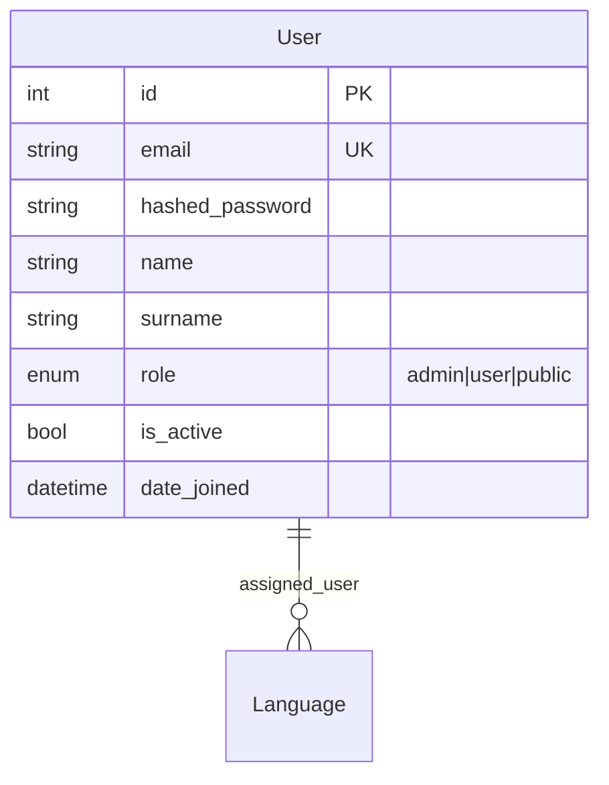
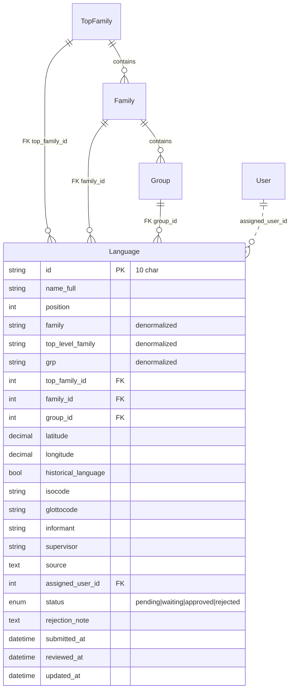
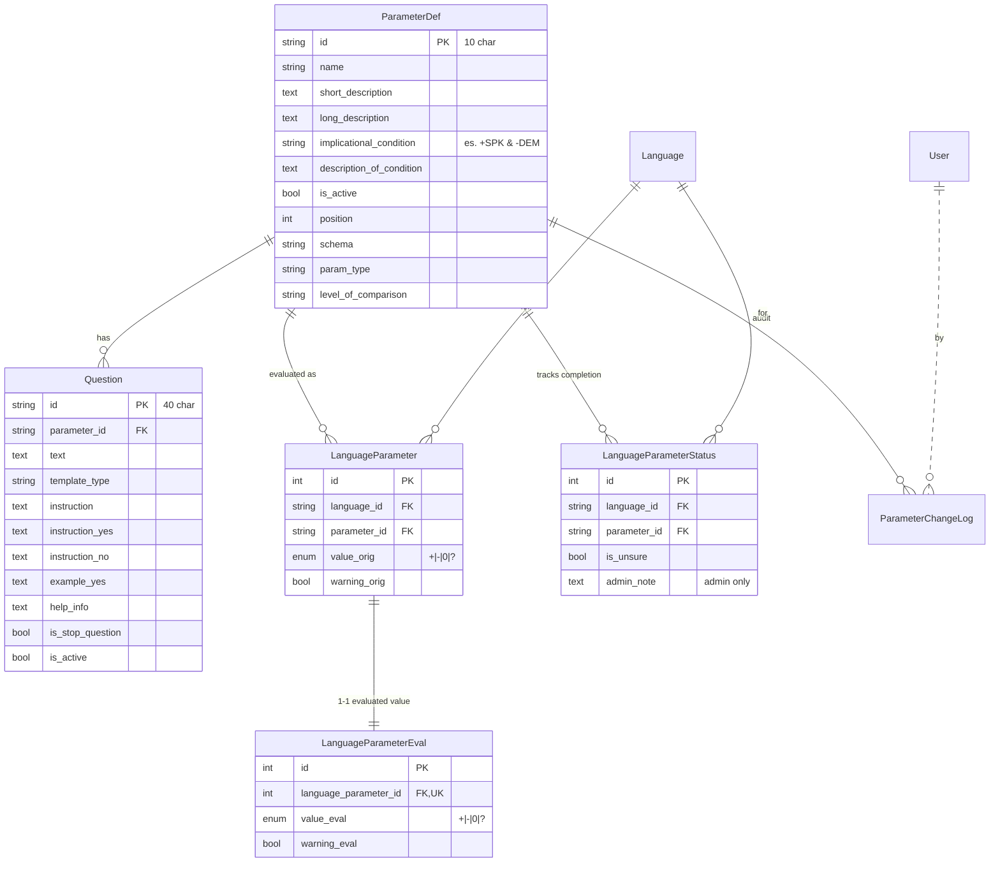
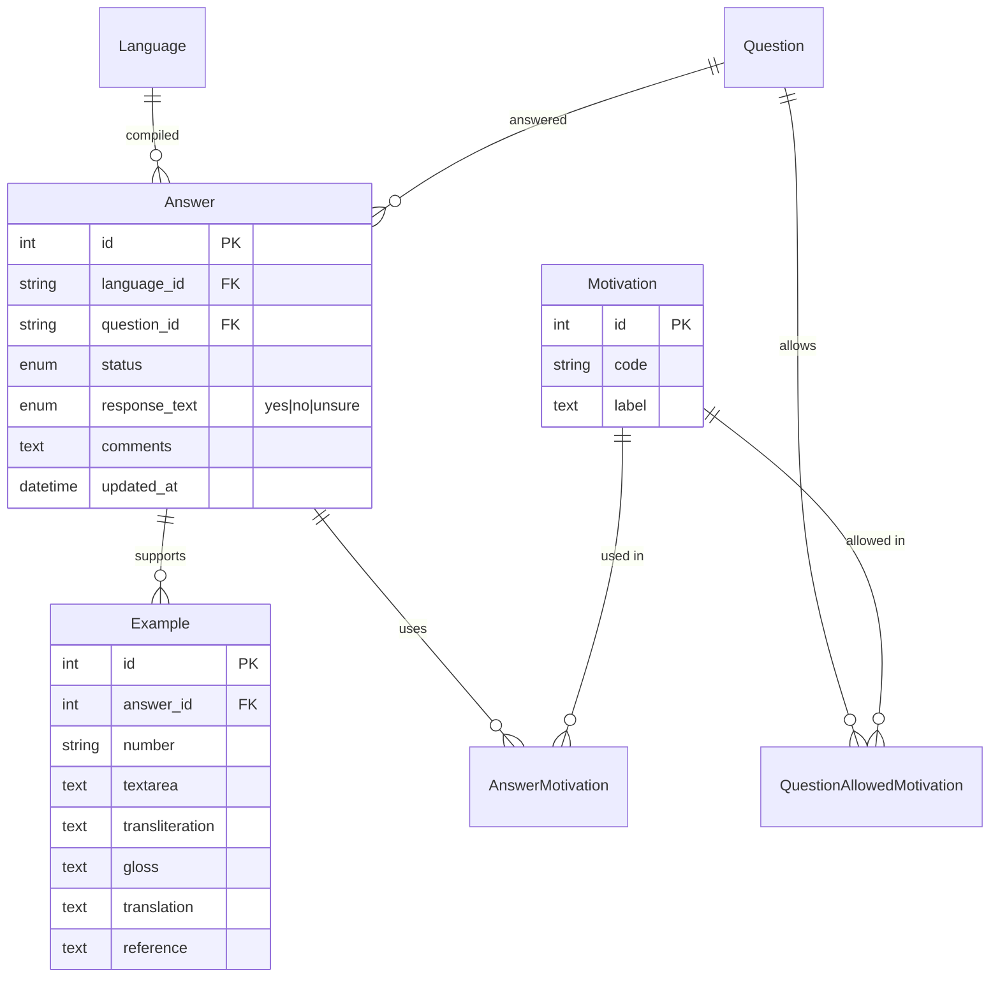
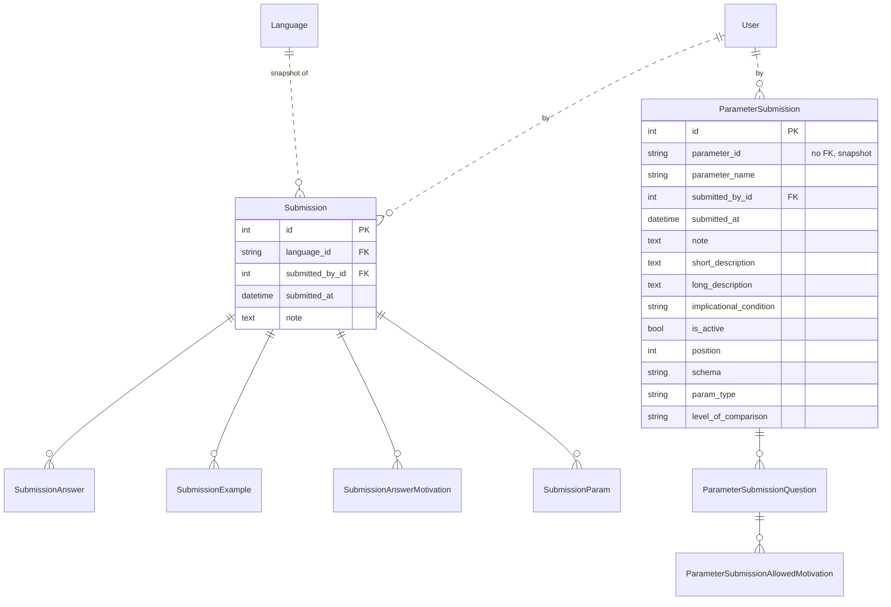
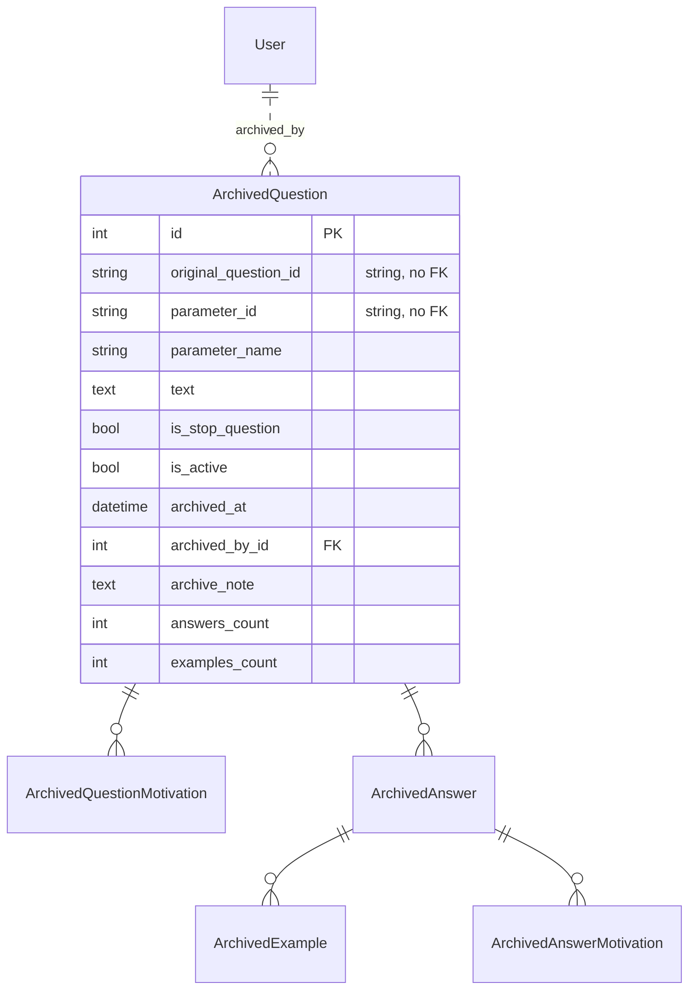
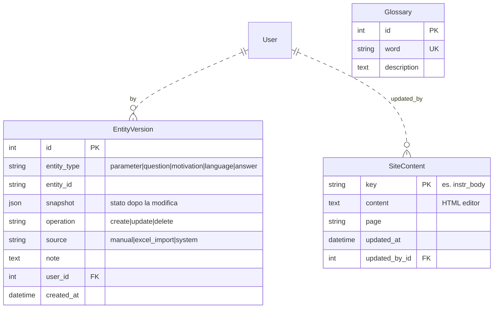

# PCM-Hub — Documentazione tecnica

Documentazione di riferimento per sviluppatori e manutentori. Per l'utilizzo del sito da parte di linguisti/admin vedi [manuale_utente_it.md](manuale_utente_it.md).

---

## Indice

1. [Panoramica](#1-panoramica)
2. [Stack tecnologico](#2-stack-tecnologico)
3. [Architettura](#3-architettura)
4. [Setup dell'ambiente di sviluppo](#4-setup-dellambiente-di-sviluppo)
5. [Struttura del repository](#5-struttura-del-repository)
6. [Modello dei dati](#6-modello-dei-dati)
7. [Autenticazione e autorizzazione](#7-autenticazione-e-autorizzazione)
8. [API reference](#8-api-reference)
9. [Workflow di compilazione di una lingua](#9-workflow-di-compilazione-di-una-lingua)
10. [Funzionalità chiave](#10-funzionalità-chiave)
11. [Servizi e processi in background](#11-servizi-e-processi-in-background)
12. [Frontend SPA](#12-frontend-spa)
13. [Deploy](#13-deploy)
14. [Testing](#14-testing)
15. [Debt tecnico noto](#15-debt-tecnico-noto)

---

## 1. Panoramica

PCM-Hub è la web app del **Parametric Comparison Method** (PCM, Longobardi & Guardiano 2009): raccoglie, organizza e confronta dati sintattici di lingue naturali tramite un set di **parametri universali**. Ogni lingua viene "compilata" (un linguista assegnato risponde a un set di domande per ogni parametro) e l'app produce in automatico le matrici comparative, le distanze inter-lingua, dendrogrammi, mappe geografiche e altri output di analisi.

Tre categorie di utenti:

- **Public** (anonimo): vede la home con la mappa interattiva delle lingue e le citation guidelines.
- **User** (linguista): compila le lingue che gli sono state assegnate, accede a glossario, istruzioni, lista lingue.
- **Admin**: gestisce parametri, domande, motivazioni, tassonomia, account, backup, export massivi, TableA, query analitiche cross-lingua.

L'istanza di produzione è ospitata sul dominio `hub.parametricomparison.unimore.it` su una VM gestita via Portainer.

---

## 2. Stack tecnologico

| Layer | Tecnologia | Note |
|---|---|---|
| Backend | **FastAPI** + Uvicorn | Python 3.x, [backend/main.py](backend/main.py) |
| ORM | **SQLAlchemy 2.x** | [backend/models.py](backend/models.py) |
| DB | **PostgreSQL 16** | Postgres in Alpine, schema gestito da Alembic |
| Migrations | **Alembic** | [backend/alembic/](backend/alembic/) |
| Auth | JWT (python-jose) + bcrypt | Token Bearer in header, no cookie |
| Rate limiting | **slowapi** | login 5 tentativi/min/IP |
| Frontend | **React 18 + Vite + Rolldown** | [frontend/src/](frontend/src/) |
| Routing SPA | **react-router-dom v6** | `createBrowserRouter` |
| Mappe | **OpenLayers** | OSM tiles |
| Editor WYSIWYG | **TinyMCE** | lazy-loaded, solo admin |
| Charts/analitica | scipy, numpy, matplotlib, plotly | server-side rendering per export |
| Reverse proxy + HTTPS | **Caddy 2** | [caddy/Caddyfile](caddy/Caddyfile) |
| Container | Docker Compose | dev: [docker-compose.yml](docker-compose.yml); prod: [docker-compose.prod.yml](docker-compose.prod.yml) |

---

## 3. Architettura

### Vista a runtime (produzione)

```
                          Internet
                              │
                       ┌──────┴──────┐
                       │   Caddy 2   │  ← HTTPS Let's Encrypt automatico
                       │ (porte 80/443) │     gzip, security headers
                       └──┬──────┬───┘
                          │      │
            /api/*, /auth/*│     │/{*}
                          │      │
                ┌─────────▼──┐ ┌─▼─────────────────┐
                │  FastAPI   │ │  SPA React        │
                │  backend   │ │  (frontend_dist)  │
                │  uvicorn   │ │   served by Caddy │
                └─────┬──────┘ └───────────────────┘
                      │
                ┌─────▼──────┐    ┌──────────────────┐
                │ PostgreSQL │    │  pcm_backup      │
                │   16       │◄───┤  pg_dump 1×24h   │
                └────────────┘    └──────────────────┘

Sidecar: pcm_cleaner (docker prune giornaliero)
         pcm_frontend_build (one-shot al deploy: npm ci && npm run build)
```

Tutti i servizi vivono in volumi Docker nominati: `postgres_data`, `caddy_data`, `caddy_config`, `frontend_dist`, `pcm_backups`. Vedi [DEPLOY_NOTES.txt](DEPLOY_NOTES.txt) §1, §4.

### Vista logica (componenti backend)

```
backend/
├── main.py              ← FastAPI app, CORS, rate limiter, lifespan, router include
├── config.py            ← env vars, fail-fast in prod
├── auth.py              ← bcrypt + JWT helpers
├── dependencies.py      ← get_db, get_current_user, require_admin
├── database.py          ← create_engine, SessionLocal
├── models.py            ← TUTTI i modelli SQLAlchemy
├── time_utils.py        ← utc_now() naive UTC
├── rate_limit.py        ← limiter slowapi condiviso
├── routers/             ← un file per area funzionale (vedi §8)
└── services/            ← logica complessa fuori dai router (DAG, export, ecc.)
```

I **router** delegano alla logica di business presente in [backend/services/](backend/services/) per mantenere gli endpoint sottili. Esempi:

- `services/dag_eval.py` — esegue il DAG implicazionale dei parametri per una lingua
- `services/recompute.py` — ricalcola i `value_orig`/`value_eval` di un parametro su tutte le lingue
- `services/excel_import.py`, `services/excel_export.py` — round-trip Excel
- `services/backup_service.py`, `services/parameter_backup_service.py` — snapshot di lingue e parametri
- `services/migration_import.py` — import del bundle ZIP dal sito vecchio
- `services/versioning.py` — registra `EntityVersion` per audit

---

## 4. Setup dell'ambiente di sviluppo

### Prerequisiti

- Docker Desktop (con Compose v2)
- Git
- Per lavorare sul codice: editor a piacere (consigliato VS Code)

### Primo avvio

```powershell
git clone <repo-url> pcm-hub
cd pcm-hub
copy .env.example .env
# Modifica .env se vuoi (default funzionano per dev)
docker compose up -d
docker compose exec backend alembic upgrade head
```

Al primo avvio [services/admin_bootstrap.py](backend/services/admin_bootstrap.py) crea automaticamente un admin con le credenziali di `ADMIN_EMAIL`/`ADMIN_PASSWORD` (default dev: `admin@local`/`admin`).

URL:

- Frontend Vite dev: <http://localhost:5173>
- Backend FastAPI: <http://localhost:8000>
- Swagger UI (solo dev): <http://localhost:8000/docs>
- DB Postgres dall'host: `127.0.0.1:5433` (utente/password da `.env`)

### Hot reload

- Backend: `uvicorn --reload` riavvia su modifica di file Python (volume bind-mount `./backend:/app`).
- Frontend: Vite HMR.

### Trappola comune (`node_modules` disallineato)

Il container `pcm_frontend` ha un volume anonimo che maschera `/app/node_modules`. Se aggiungi una dipendenza in `package.json` la prima volta non la troverai dentro al container. Soluzione:

```powershell
docker compose exec frontend npm ci
```

In **prod** non succede: `frontend_build` parte sempre da zero su `npm ci`.

### Variabili d'ambiente (vedi [backend/config.py](backend/config.py))

| Var | Dev default | Prod | Note |
|---|---|---|---|
| `ENV` | `dev` | `prod` | abilita fail-fast |
| `SECRET_KEY` | `dev-insecure-change-me` | obbligatoria | JWT signing |
| `ACCESS_TOKEN_EXPIRE_MINUTES` | `30` | `30` | scadenza token |
| `ADMIN_EMAIL` / `ADMIN_PASSWORD` | `admin@local` / `admin` | obbligatorie | bootstrap primo admin |
| `POSTGRES_*` | `pcm_user`/`pcm_password`/`pcm_hub` | obbligatorie | credenziali DB |
| `DATABASE_URL` | costruito | esplicito | override URL completo |
| `CORS_ORIGINS` | `http://localhost:5173,...` | dominio prod | whitelist CORS, no wildcard |

In prod: SECRET_KEY, ADMIN_EMAIL, ADMIN_PASSWORD obbligatorie. Senza, l'app **non parte** (vedi [config.py](backend/config.py) §Auth/JWT, §Bootstrap admin).

---

## 5. Struttura del repository

```
pcm-hub/
├── backend/                 ← FastAPI + SQLAlchemy + Alembic
│   ├── alembic/             ← migrations versionate
│   ├── routers/             ← endpoint per area funzionale (vedi §8)
│   ├── services/            ← logica complessa (DAG, export, backup, ecc.)
│   ├── tests/               ← pytest + sqlite in-memory
│   ├── main.py
│   ├── config.py
│   ├── auth.py
│   ├── dependencies.py
│   ├── database.py
│   ├── models.py
│   ├── rate_limit.py
│   ├── time_utils.py
│   ├── requirements.txt
│   └── Dockerfile
├── frontend/                ← React 18 + Vite
│   ├── src/
│   │   ├── api.js           ← axios client centralizzato
│   │   ├── App.jsx          ← createBrowserRouter
│   │   ├── main.jsx
│   │   ├── context/
│   │   │   └── AuthContext.jsx
│   │   ├── components/      ← Layout, AdminRoute, Drawer, ecc.
│   │   ├── features/        ← un sottodir per area funzionale
│   │   │   ├── auth/
│   │   │   ├── public/
│   │   │   ├── dashboard/
│   │   │   ├── languages/
│   │   │   ├── compilation/
│   │   │   ├── parameters/
│   │   │   ├── questions/
│   │   │   ├── motivations/
│   │   │   ├── glossary/
│   │   │   ├── instructions/
│   │   │   ├── tablea/
│   │   │   ├── queries/
│   │   │   ├── accounts/
│   │   │   ├── taxonomy/
│   │   │   ├── history/
│   │   │   ├── backups/
│   │   │   └── admin/       ← Migration, BackupRestore, ImportExcel
│   │   └── utils/           ← helper condivisi (search, dateFormat, ecc.)
│   ├── public/              ← favicon, PDF informative, asset statici
│   ├── package.json
│   └── Dockerfile
├── caddy/
│   └── Caddyfile            ← reverse proxy + HTTPS Let's Encrypt
├── docker-compose.yml       ← stack dev
├── docker-compose.prod.yml  ← stack prod (Portainer)
├── DEPLOY_NOTES.txt         ← notes architetturali deploy
├── DEPLOY_PROCEDURA.txt     ← checklist clic-per-clic deploy
├── .env.example             ← template env
└── docs/                    ← (questa cartella)
    ├── documentation_it.md  ← (questo file)
    ├── documentation_en.md
    ├── manuale_utente_it.md
    └── user_manual_en.md
```

---

## 6. Modello dei dati

> ⚠ La **fonte di verità** sui modelli è sempre [backend/models.py](backend/models.py). Questo capitolo è una mappa per orientarsi, non un riferimento campo-per-campo che andrà fatalmente out-of-sync. Le migrazioni Alembic in [backend/alembic/versions/](backend/alembic/versions/) congelano il DDL effettivo applicato.

### 6.1 Mappa delle famiglie

I 27 modelli si raggruppano in 7 famiglie logiche:

| Famiglia | Scope | Modelli |
|---|---|---|
| **Auth & Users** | Identità, ruoli, assegnazioni | `User` |
| **Lingue & Tassonomia** | Lingue + gerarchia (top-family > family > group) | `Language`, `TopFamily`, `Family`, `Group` |
| **Parametri & Domande** | Definizione parametri, condizioni implicazionali, valutazione per lingua | `ParameterDef`, `Question`, `ParamSchema`, `ParamType`, `ParamLevelOfComparison`, `LanguageParameter`, `LanguageParameterEval`, `LanguageParameterStatus`, `ParameterChangeLog` |
| **Risposte & Esempi** | Compilazione di un linguista per una lingua | `Answer`, `Example`, `Motivation`, `QuestionAllowedMotivation`, `AnswerMotivation` |
| **Backup & Submission** | Snapshot di lingue (dati) e parametri (definizioni) | `Submission`, `SubmissionAnswer`, `SubmissionExample`, `SubmissionAnswerMotivation`, `SubmissionParam`, `ParameterSubmission`, `ParameterSubmissionQuestion`, `ParameterSubmissionAllowedMotivation` |
| **Archivio Domande** | Domande "ritirate" + dati ad esse collegati, freezati | `ArchivedQuestion`, `ArchivedQuestionMotivation`, `ArchivedAnswer`, `ArchivedExample`, `ArchivedAnswerMotivation` |
| **Cronologia & Site Content** | Audit/diff + contenuti dinamici + glossario | `EntityVersion`, `SiteContent`, `Glossary` |

### 6.2 Diagrammi ER per famiglia

#### Auth & Users



#### Lingue & Tassonomia



#### Parametri & Domande



`ParamSchema`, `ParamType`, `ParamLevelOfComparison` sono tabelle di lookup (id+label) usate per popolare le tendine di ParameterForm; il valore "vincente" resta la stringa salvata su `ParameterDef.schema/param_type/level_of_comparison`.

#### Risposte & Esempi (compilazione)



`Answer` ha `UniqueConstraint(language_id, question_id)` → una sola Answer per (lingua, domanda).

#### Backup & Submission (snapshot)



Le `Submission*` congelano lo stato di una lingua nel tempo (per il restore), le `ParameterSubmission*` congelano la definizione di un parametro. **In entrambi i casi** i riferimenti verso `Language`/`Question`/`Motivation` sono salvati come stringhe (no FK rigide), così uno snapshot resta leggibile anche se l'entità originale è stata cancellata o rinominata. Pattern denormalizzato voluto.

#### Archivio Domande



Quando una `Question` viene modificata in modo non compatibile con i dati raccolti, le `Answer`/`Example`/`AnswerMotivation` collegate vengono spostate qui insieme a uno snapshot della Question stessa. Anche qui le motivations e le lingue sono denormalizzate (code/label/name come stringhe).

#### Cronologia & Site Content



`EntityVersion` è la tabella generica usata per audit/diff: ogni modifica di Parameter/Question/Motivation/Language/Answer ne genera una riga con lo snapshot completo, e nella UI History si visualizza il "prima/dopo" confrontando con la versione precedente. Vedi [services/versioning.py](backend/services/versioning.py).

### 6.3 Modelli chiave (dettaglio)

Per le 5 entità più centrali ecco le **invarianti** importanti, che le tabelle di sopra non mostrano:

#### `User` ([models.py:12-26](backend/models.py#L12-L26))

- `email` `UNIQUE`. Nel codice viene sempre `email.lower()` prima di salvare/cercare (vedi [routers/users.py](backend/routers/users.py)).
- `role` è un Enum Postgres con valori `admin|user|public`. Modificarlo richiede una migrazione Alembic dedicata (Alembic non gestisce nativamente l'evoluzione degli enum, va fatto a mano con `ALTER TYPE`).
- `terms_accepted` / `terms_accepted_at` previsti per consenso GDPR ma oggi non esposti nella UI (gli account sono creati direttamente dall'admin in [AccountCreate.jsx](frontend/src/features/accounts/AccountCreate.jsx)).
- L'eliminazione di un User che ha lingue assegnate non cascade-elimina la lingua: `assigned_user_id` viene messo a NULL ([routers/users.py](backend/routers/users.py) `delete_account`).

#### `Language` ([models.py:31-76](backend/models.py#L31-L76))

- `id` è una **stringa** di max 10 caratteri (es. `ITA`, `LATC`), case-insensitive nelle query (vedi pattern `func.lower(Language.id) == lang_id.lower()` in [compilation.py](backend/routers/compilation.py)).
- I tre campi `top_level_family`, `family`, `grp` sono **stringhe denormalizzate**, parallele alle FK `top_family_id`/`family_id`/`group_id`. Tenute sincronizzate al save di [LanguageForm.jsx](frontend/src/features/languages/LanguageForm.jsx). Le stringhe restano la fonte di verità per filtri e export, le FK servono per il modulo "Taxonomy" (CRUD gerarchico).
- `status` segue il workflow `pending → waiting_for_approval → approved/rejected → (reopen) pending`. Vedi §9.
- `updated_at` è bumpato automaticamente da SQLAlchemy a ogni UPDATE della riga `Language`. **Cambi alle answers non aggiornano questo campo.**

#### `ParameterDef` ([models.py:118-133](backend/models.py#L118-L133))

- `id` stringa, max 10 caratteri (es. `FGM`, `SPK`).
- `implicational_condition`: stringa con sintassi tipo `+SPK & -DEM`, parsata da [services/logic_parser.py](backend/services/logic_parser.py) (pyparsing). Validata al save in [routers/parameters.py](backend/routers/parameters.py).
- `is_active=False` esclude il parametro dalla compilazione, dal DAG, da TableA, dagli export. Mantenere lo storico delle risposte è gestito dall'archivio (vedi sotto e §10).
- `position` è l'ordine di visualizzazione (drag & drop in ParameterList). Riordinare invoca `POST /api/admin/parameters/reorder` che riassegna le `position` di tutti i parametri.
- Cancellare un `ParameterDef` cascade-cancella le `Question` (cascade SQLAlchemy `all, delete-orphan`).

#### `Question` ([models.py:169-185](backend/models.py#L169-L185))

- `id` stringa, max 40 caratteri (convenzione: `<param_id>_<NN>`, es. `FGM_01`).
- `is_stop_question=True` segna le "domande di chiusura" del blocco parametro.
- `instruction`, `instruction_yes`, `instruction_no`, `example_yes`, `help_info` sono testo libero che la UI di compilazione mostra contestualmente alla risposta scelta dal linguista (vedi [QuestionRow.jsx](frontend/src/features/compilation/QuestionRow.jsx)).
- `is_active=False`: la domanda non viene proposta in compilazione. Le risposte storiche si vedono ancora in TableA in modalità "questions" se l'admin spunta "show inactive".
- Modifiche distruttive (es. cambio `template_type`) spostano le Answer e gli Example collegati nell'archivio (vedi [services/archive_service.py](backend/services/archive_service.py)).

#### `Answer` ([models.py:190-209](backend/models.py#L190-L209))

- `UniqueConstraint(language_id, question_id)`: **una sola Answer per (lingua, domanda)**.
- `response_text` è un Enum nullable `yes|no|unsure`. La stringa vuota nel payload viene normalizzata a `None` in [compilation.py](backend/routers/compilation.py).
- Vincolo applicativo (non DB): se `response_text in ('yes','unsure')`, **almeno 2 esempi non vuoti** devono essere presenti. Validato in `save_parameter_block` con `HTTPException(400, code="missing_examples")`. Il frontend usa il payload strutturato per scrollare alla card incriminata e applicarle un highlight rosso.
- `updated_at` bumpato a ogni UPDATE: usato come **fingerprint** per l'optimistic concurrency check del save (vedi §9).

---

## 7. Autenticazione e autorizzazione

### Login

Endpoint: `POST /auth/login` ([routers/auth.py](backend/routers/auth.py)).

- Rate-limit: 5 tentativi/minuto per IP (slowapi). Quando superato → HTTP 429.
- Verifica password con `bcrypt.checkpw` ([auth.py](backend/auth.py)).
- Risposta: `{ access_token, token_type: "bearer", role, name }`.

### JWT

- Algoritmo: HS256 (configurabile via `JWT_ALGORITHM`).
- Payload: `{ sub: <email>, role: <role>, exp: <utc_timestamp> }`.
- Scadenza: `ACCESS_TOKEN_EXPIRE_MINUTES` (default 30).
- Niente refresh token, niente blacklist (vedi §15 Debt).

### Storage lato client

Il frontend salva il token in **localStorage**. Conseguenze:

- L'interceptor di request in [api.js](frontend/src/api.js) aggiunge `Authorization: Bearer <token>` a ogni chiamata.
- L'interceptor di response gestisce 401: rimuove il token e (se non si è su `/`, `/login`, `/how-to-cite`) ridireziona a `/login`.
- Suscettibile a XSS: vedi `DEPLOY_NOTES.txt` §8 — migrazione a cookie HttpOnly è un debt noto.

### Dipendenze server-side ([dependencies.py](backend/dependencies.py))

- `get_db()`: yields a `Session`, chiusa al return.
- `get_current_user()`: decodifica il JWT, recupera lo `User` dal DB. 401 se token mancante/scaduto/firma non valida.
- `require_admin()`: chiama `get_current_user` e poi controlla `role == "admin"`. 403 altrimenti.

### Mappa autorizzazioni endpoint

| Area | Auth richiesta | Note |
|---|---|---|
| `/auth/login` | nessuna | rate-limited |
| `/healthz` | nessuna | health check Docker |
| `/api/public/*` | nessuna | mappa, site-content, glossario read-only |
| `/api/me`, `/api/me/password` | `get_current_user` | profilo personale |
| `/api/languages/*/compilation`, `/save_block`, `/workflow/*` | `get_current_user` | con check addizionale `assigned_user_id` per non-admin (vedi §9) |
| `/api/admin/*` | `require_admin` | parametri, motivations, taxonomy, accounts, backups, history, migration, ecc. |
| `/api/tablea/options` | `get_current_user` | usato anche dai filtri di LanguageList |
| `/api/tablea/matrix`, `/api/tablea/export/*` | `require_admin` | TableA matrice + export |
| `/api/queries/*` | `require_admin` | dashboard analitica Q1-Q10 |

### Frontend: `<AdminRoute>`

[components/AdminRoute.jsx](frontend/src/components/AdminRoute.jsx) protegge le rotte SPA admin-only leggendo `useAuth().user.role` (NON da `localStorage`, per evitare bypass via DevTools). È solo UX: la difesa vera è server-side.

---

## 8. API reference

Per ogni router elenco prefisso, scope e endpoint principali. Per il dettaglio dei payload Pydantic vedere il file linkato.

### `/auth` ([routers/auth.py](backend/routers/auth.py))

| Endpoint | Auth | Note |
|---|---|---|
| `POST /auth/login` | nessuna | rate-limited 5/min/IP |

### `/api/me` ([routers/users.py](backend/routers/users.py))

| Endpoint | Auth | Note |
|---|---|---|
| `GET /api/me` | utente | profilo |
| `PUT /api/me` | utente | aggiorna name/surname/email (con validazione formato email) |
| `PUT /api/me/password` | utente | cambia password (richiede `old_password` + min 8 char) |

### `/api/admin/accounts` ([routers/users.py](backend/routers/users.py))

| Endpoint | Auth | Note |
|---|---|---|
| `GET /api/admin/accounts` | admin | lista utenti + lingue assegnate |
| `GET /api/admin/accounts/{user_id}` | admin | dettaglio utente |
| `POST /api/admin/accounts` | admin | crea utente (validazione email + password) |
| `PUT /api/admin/accounts/{user_id}/languages` | admin | (ri)assegna pool di lingue (sostituisce il precedente) |
| `DELETE /api/admin/accounts/{user_id}` | admin | safeguard: non elimina te stesso, non l'ultimo admin |

### `/api/languages` (compilation) ([routers/compilation.py](backend/routers/compilation.py))

| Endpoint | Auth | Note |
|---|---|---|
| `GET /api/languages/{lang_id}/compilation` | utente | bundle dati per la pagina di compilazione (tutti i parametri attivi + answers + admin_note solo per admin) |
| `POST /api/languages/{lang_id}/parameters/{param_id}/save_block` | utente | salva un blocco parametro: optimistic concurrency check, validazione `≥2 esempi su yes/unsure`, ricalcolo `LanguageParameter`, DAG eseguito in `BackgroundTask` |
| `GET /api/languages/{lang_id}/debug` | admin | debug page (valori init/eval per tutti i parametri + condizioni) |
| `POST /api/languages/{lang_id}/workflow/submit` | utente assegnato | `pending\|rejected → waiting_for_approval` |
| `POST /api/languages/{lang_id}/workflow/approve` | admin | `waiting_for_approval → approved` |
| `POST /api/languages/{lang_id}/workflow/reject` | admin | `waiting_for_approval → rejected`, con nota |
| `POST /api/languages/{lang_id}/workflow/reopen` | utente assegnato o admin | `rejected → pending` |
| `POST /api/languages/{lang_id}/workflow/admin_force_*` | admin | force-transitions: approve/reject/pending/waiting da QUALSIASI stato |
| `POST /api/languages/{lang_id}/workflow/run_dag` | admin | esegue DAG manualmente |
| `GET /api/languages/examples/search` | utente | ricerca esempi per il selettore di import in compilazione (priorità stessa-lingua) |

### `/api/admin/languages` ([routers/languages.py](backend/routers/languages.py))

CRUD lingue (list, get, create, update, delete, duplicate). Vedi file per il dettaglio.

### `/api/admin/parameters` ([routers/parameters.py](backend/routers/parameters.py))

CRUD parametri + reorder + deactivate (con conferma password). Endpoint export PDF di un parametro o di tutti.

### `/api/admin/parameters_graph` ([routers/parameters_graph.py](backend/routers/parameters_graph.py))

Grafo del DAG implicazionale visualizzabile in [ParameterGraph.jsx](frontend/src/features/parameters/ParameterGraph.jsx).

### `/api/admin/questions` ([routers/questions.py](backend/routers/questions.py))

CRUD domande. Modifiche distruttive (cambio `template_type` o cancellazione) spostano le Answer collegate nell'`ArchivedQuestion`.

### `/api/admin/motivations` ([routers/motivations.py](backend/routers/motivations.py))

CRUD motivations + collegamento a `QuestionAllowedMotivation`.

### `/api/admin/taxonomy` ([routers/taxonomy.py](backend/routers/taxonomy.py))

CRUD gerarchia top-family > family > group. Drag & drop in [Taxonomy.jsx](frontend/src/features/taxonomy/Taxonomy.jsx).

### `/api/glossary` + `/api/admin/glossary` ([routers/glossary.py](backend/routers/glossary.py))

`/api/glossary` (no auth) read-only, `/api/admin/glossary` CRUD admin.

### `/api/content/{key}`, `/api/admin/site-content/{key}`, `/api/public/site-content`, `/api/public/map-data` ([routers/site_content.py](backend/routers/site_content.py))

CMS minimo per i blocchi HTML editabili (Instructions, How to cite). Public endpoints per home e how-to-cite.

### `/api/instructions` ([routers/instructions.py](backend/routers/instructions.py))

Helper specifici per la pagina Instructions.

### `/api/tablea` ([routers/tablea.py](backend/routers/tablea.py))

| Endpoint | Auth | Output |
|---|---|---|
| `GET /api/tablea/options` | utente | tendine filtri (top family, family, group, schema, type, level, template, lingue) |
| `POST /api/tablea/matrix` | admin | matrice cross-language (params o questions in righe) |
| `POST /api/tablea/export/xlsx` | admin | XLSX con header citazione |
| `POST /api/tablea/export/csv` | admin | CSV trasposto |
| `POST /api/tablea/export/distances` | admin | matrici Hamming/Jaccard in `.txt` |
| `POST /api/tablea/export/geo_distances` | admin | matrici GCD in km |
| `POST /api/tablea/export/dendrograms` | admin | dendrogrammi UPGMA in PNG |
| `POST /api/tablea/export/cluster_map` | admin | mappa interattiva HTML cluster UPGMA |
| `POST /api/tablea/export/pca` | admin | analisi PCA in PNG |
| `POST /api/tablea/export/mantel` | admin | Mantel test su sottoinsieme di {GCD, Hamming, Jaccard+} |

### `/api/queries` ([routers/queries.py](backend/routers/queries.py))

10 query analitiche (Q1-Q10). Vedi [QueriesDashboard.jsx](frontend/src/features/queries/QueriesDashboard.jsx) per le label utente. Tutti gli endpoint admin-only.

### `/api/admin/dashboard`, `/api/user/dashboard` ([routers/dashboard.py](backend/routers/dashboard.py))

Aggregati per il widget Dashboard (admin: lingue da revisionare, parametri rossi, ultime modifiche; user: lingue assegnate con progress).

### `/api/admin/backups`, `/api/admin/backups/parameters` ([routers/backup.py](backend/routers/backup.py), [routers/parameters_backup.py](backend/routers/parameters_backup.py))

Snapshot via Submission/ParameterSubmission, listing per timestamp.

### `/api/admin/migration` ([routers/migration.py](backend/routers/migration.py))

Import del bundle ZIP dal sito vecchio. `wipe=true` opzionale. File caps e validation antizip-bomb in [services/migration_import.py](backend/services/migration_import.py).

### `/api/admin/backup_restore` ([routers/backup_restore.py](backend/routers/backup_restore.py))

Restore di un backup pregresso da bundle ZIP.

### `/api/admin/import-excel` ([routers/import_excel.py](backend/routers/import_excel.py))

Round-trip Excel admin: import strutturato cap 50 MB, [services/excel_import.py](backend/services/excel_import.py).

### `/api/export` ([routers/export.py](backend/routers/export.py))

Export bundle ZIP di lingue (job asincrono con polling status), export GCD txt, export metadata XLSX.

### `/api/admin/recompute` ([routers/recompute.py](backend/routers/recompute.py))

Job asincrono di "recompute final values for all languages": rilancia DAG + consolidate su tutte le lingue. Polling status simile all'export ZIP.

### `/api/admin/versions`, `/api/admin/archived-questions` ([routers/history.py](backend/routers/history.py), [routers/archived_questions.py](backend/routers/archived_questions.py))

Filtraggio cronologia `EntityVersion` + accesso all'archivio domande/risposte.

---

## 9. Workflow di compilazione di una lingua

### Stati

```
            submit
   pending ─────────► waiting_for_approval
      ▲                    │
      │                    │ approve  │ reject
      │ admin_force_pending│          │
      │                    ▼          ▼
      │                approved   rejected
      │                              │
      └──────────  reopen  ◄─────────┘
```

### Permessi

- `submit`: solo l'utente assegnato. Admin no.
- `approve`/`reject`: solo admin.
- `reopen`: utente assegnato o admin.
- `admin_force_*`: solo admin, da qualsiasi stato (per fix manuali, rollback, dopo migrazione bundle).

### Lock di scrittura

`_ensure_can_modify` ([compilation.py](backend/routers/compilation.py)):

- **admin**: può sempre scrivere, a prescindere dallo stato.
- **utente assegnato**: può scrivere solo se `status in {pending, rejected}`.
- altri: `403 Forbidden`.

### `save_parameter_block` (cuore dell'applicazione)

Endpoint: `POST /api/languages/{lang_id}/parameters/{param_id}/save_block` ([compilation.py](backend/routers/compilation.py)).

Sequenza:

1. **Lock pessimistico** sulla `Language` (`SELECT ... FOR UPDATE`) per serializzare due save concorrenti sulla stessa lingua.
2. **`_ensure_can_modify`** (vedi sopra).
3. **Optimistic concurrency check**: il client manda `expected_last_modified` (il MAX(updated_at) delle Answer del parametro al momento del fetch). Se il valore corrente nel DB è diverso → 409 con `code: stale_block`. Tipico caso: admin e linguista che editano in parallelo.
4. **Upsert `LanguageParameterStatus`** con `is_unsure` (e `admin_note` se admin).
5. **Per ogni Answer in payload**:
   - normalizza `response_text` (`""` → `None`);
   - se `response_text in ('yes', 'unsure')` valida ≥2 esempi non vuoti, altrimenti `400 missing_examples` con `question_id` dell'incriminata (frontend usa il campo per scrollare e flashare la card);
   - upsert dell'`Answer`, ricrea `AnswerMotivation` (se `no`) e `Example` (se `yes`/`unsure`);
   - aggiungi alla lista `touched`.
6. **Versioning**: per ogni Answer touched, se è cambiata davvero (snapshot diff), registra una `EntityVersion`.
7. `db.commit()`.
8. **Recompute consolidate** del parametro per la lingua (`recompute_and_persist_language_parameter`): ricalcola `LanguageParameter.value_orig` e `warning_orig` aggregando le Answer.
9. `db.commit()`.
10. **DAG** (`run_dag_for_language`) schedulato come `BackgroundTask`: parte dopo l'invio della response al client. Aggiorna `LanguageParameterEval.value_eval/warning_eval` per tutti i parametri della lingua, propagando le condizioni implicazionali.

Ritorno: `{ detail, last_modified }` — il client usa `last_modified` come nuovo fingerprint per il prossimo save.

### Il DAG implicazionale

Vedi [services/dag_eval.py](backend/services/dag_eval.py).

- Per ogni `ParameterDef.implicational_condition` (es. `+SPK & -DEM`), si estraggono i parametri "ref" citati.
- Si costruisce il grafo `ref → target` (un parametro target dipende dai suoi ref).
- Topological sort.
- In ordine, per ogni parametro target: si valuta la condizione usando i `value_eval` (o, se assenti, `value_orig`) dei ref. Se la condizione **non è soddisfatta**, il `value_eval` del target è forzato a `0` (neutralizzato) con `warning_eval=True`.
- Le warning si propagano: se un ref ha `warning_eval=True`, anche tutti i suoi discendenti ereditano la warning.

L'idea: un parametro è "comparabile" solo se le sue precondizioni linguistiche sono soddisfatte; altrimenti il valore originale è mascherato da uno `0`.

`logic_parser.py` usa **pyparsing** (versione lock-ata `3.1.2`) per supportare grammatica `+P`, `-P`, `0P`, `&`, `|`, parentesi, `~` (not).

---

## 10. Funzionalità chiave

### TableA ([routers/tablea.py](backend/routers/tablea.py), [features/tablea/TableA.jsx](frontend/src/features/tablea/TableA.jsx))

Matrice **lingue × parametri** (o lingue × domande). Filtri: top-family/family/group, lingue specifiche (checkbox), schema/type/level del parametro, template/stop della domanda. Selezione manuale righe.

Export: XLSX, CSV trasposto, matrici di distanza Hamming/Jaccard (.txt zip), distanze geografiche GCD (km), dendrogrammi PNG, cluster map HTML interattiva, PCA, Mantel test.

### Queries Dashboard (Q1-Q10) ([routers/queries.py](backend/routers/queries.py), [features/queries/QueriesDashboard.jsx](frontend/src/features/queries/QueriesDashboard.jsx))

Dashboard di interrogazione del DB con 10 viste pre-definite:

- Q1: condizioni implicazionali per parametro
- Q2: valori del parametro su tutte le lingue
- Q3: "perché un parametro è neutralizzato per una lingua" (debug del DAG con blame)
- Q4-Q6: parametri con valore +/-/0 per lingua
- Q7: parametri comparabili tra coppie di lingue
- Q8-Q9: domande con yes/no per lingua
- Q10: risposte ed esempi per domanda

Q3 (`BlameTable`) merita una nota: ricostruisce il "perché" un parametro è stato forzato a 0 mostrando quale condizione è fallita e qual è il valore di ogni ref citato.

### History & Backups ([features/history/](frontend/src/features/history/))

4 tab:

- **Change history** — `EntityVersion` filtrabile (entity_type, operation, source, user, date, search). Drawer con diff prima/dopo per ogni versione.
- **Answer changes** — stesso, focalizzato sulle modifiche `entity_type=answer`.
- **Full backups** — Submission e ParameterSubmission listate per timestamp, dettaglio drawer.
- **Old questions archive** — domande archiviate con le risposte storicizzate.

### Backup & Migration

- **Bundle ZIP** scaricabile/uploadabile da [BackupRestore.jsx](frontend/src/features/admin/BackupRestore.jsx) e [MigrationImport.jsx](frontend/src/features/admin/MigrationImport.jsx). Cap 200 MB, validation contro path-traversal e zip-bomb.
- **pg_dump nightly** dal sidecar `pcm_backup` (vedi [docker-compose.prod.yml](docker-compose.prod.yml)). Volume `pcm_backups`, KEEP=3.
- **Excel import/export**: round-trip strutturato in [services/excel_import.py](backend/services/excel_import.py) e [services/excel_export.py](backend/services/excel_export.py). Cap 50 MB sul file.

---

## 11. Servizi e processi in background

### `BackgroundTasks` di FastAPI

- `_run_dag_in_background` ([compilation.py](backend/routers/compilation.py)): post-`save_block`, gira il DAG su una sessione DB dedicata. Errori loggati ma mai propagati.

### Job asincroni con polling

Pattern usato per export ZIP (`/api/export/languages/zip/*`) e recompute massivo (`/api/admin/recompute/all`):

1. `POST /start` → restituisce `{ job_id }`, lavoro accodato in `services/migration_progress.py`.
2. Frontend polla `GET /status/{job_id}` ogni 1.5s leggendo `{ phase, phase_label, current, total, finished, error }`.
3. Quando `finished:true` e niente `error`: `GET /download/{job_id}` per scaricare il file (oppure messaggio di successo per recompute).

Cleanup: TTL 1h sui job completati, no cancel server-side (cancel = chiudo solo il toast, il job continua).

### Sidecar di prod

- `pcm_backup`: while-true loop con `pg_dump` + ritenzione KEEP=3.
- `pcm_cleaner`: `docker prune` giornaliero (containers/images/builder/network), volumi nominati intoccati.

---

## 12. Frontend SPA

### Routing ([App.jsx](frontend/src/App.jsx))

`createBrowserRouter` v6 con tre layer di rotta:

- **rotte pubbliche** wrappate da `<ConditionalLayout>` (Layout normale se loggato, footer pubblico se no): `/`, `/how-to-cite`, `/login`.
- **rotte autenticate generiche** wrappate da `<Layout>`: `/dashboard`, `/me`, `/languages`, `/languages/:id/data`, `/glossary`, `/instructions`.
- **rotte admin** wrappate da `<AdminRoute><Layout>`: tutto sotto `/admin/*`, plus `/languages/add`, `/languages/:id/edit|debug`, `/tablea`, `/queries`.

Il `Layout` ha:

- sidebar collassabile (stato persistito in `localStorage` chiave `pcm-sidebar-collapsed`);
- topbar con breadcrumb auto-generato dal pathname (vedi `PATH_LABELS` in [Layout.jsx](frontend/src/components/Layout.jsx));
- toggle dark/light theme (chiave `pcm-theme`);
- `BackToTop` quando `scrollY > 400`;
- `SiteFooter` con link a Privacy Policy, Terms of Use, contatti.

### Context

[AuthContext.jsx](frontend/src/context/AuthContext.jsx): provider unico per `user`, `loading`, `login(token)`, `logout(redirectTo='/login')`, `isAdmin`. Caricato dentro il `RouterProvider` per consentire ai consumer di usare hooks del router.

### `axios` client centralizzato ([api.js](frontend/src/api.js))

- `baseURL`: in dev `http://localhost:8000`, in prod `''` (path relativi serviti da Caddy).
- Interceptor request: aggiunge `Authorization: Bearer <token>` se presente.
- Interceptor response: su 401 rimuove il token e ridireziona a `/login` (eccetto se si è già su rotte pubbliche `/`, `/login`, `/how-to-cite`).

### Pattern di dirty tracking nei form

I form più complessi (es. compilazione lingua) usano:

- `useFormDraft` ([utils/useFormDraft.js](frontend/src/utils/useFormDraft.js)): autosave del draft in localStorage con namespace per evitare clash tra entità diverse;
- `useUnsavedChangesGuard` ([utils/useUnsavedChangesGuard.js](frontend/src/utils/useUnsavedChangesGuard.js)): unisce `beforeunload` (chiusura tab/refresh) + `useBlocker` di react-router (navigazione interna, breadcrumb, back).

Vedi [LanguageData.jsx](frontend/src/features/compilation/LanguageData.jsx) per il pattern completo.

### Esempio clipboard ([utils/exampleClipboard.js](frontend/src/utils/exampleClipboard.js))

Clipboard interna (localStorage) per copiare un esempio da una question all'altra **della stessa lingua**. Persistente cross-tab. Si svuota automaticamente quando si entra in una lingua diversa da quella di origine, per evitare di "trascinare" un esempio orfano.

---

## 13. Deploy

Documentato a parte. Vedi:

- [DEPLOY_NOTES.txt](DEPLOY_NOTES.txt) — note architetturali, sezioni 0-10
- [DEPLOY_PROCEDURA.txt](DEPLOY_PROCEDURA.txt) — checklist clic-per-clic per il go-live

In sintesi: stack di prod = `db + backend + frontend_build (one-shot) + caddy + backup + cleaner` orchestrato da Portainer su una VM. HTTPS automatico via Let's Encrypt. Ribuilds via "Pull and redeploy".

---

## 14. Testing

### Backend

Suite pytest in [backend/tests/](backend/tests/) con fixture comune in [conftest.py](backend/tests/conftest.py): SQLite in-memory + `metadata.create_all` dai modelli SQLAlchemy.

```powershell
docker compose exec backend pip install pytest httpx
docker compose exec backend bash -lc "cd /app && python -m pytest -q"
```

Nota: pytest **non è in `requirements.txt`** (non è una dipendenza runtime); installalo solo nel container quando serve.

Test attuali coprono:

- `test_versioning.py` — registrazione e diff `EntityVersion`
- `test_excel_import.py` — round-trip Excel, gestione errori
- `test_excel_export.py` — generazione XLSX
- `test_backup_restore.py` — backup + restore di submission

⚠ **Debt noto** ([Bug 7](#15-debt-tecnico-noto)): 5 test in `test_excel_import.py` cercano stringhe italiane (`"non esiste"`, `"errore upstream"`, `"Sintassi"`) ma il codice produce stringhe inglesi. Da riallineare.

### Frontend

Nessuna suite di test al momento. Lint via `eslint`. Build di produzione = test implicito di compilazione.

```powershell
docker compose exec frontend npx eslint src/
docker compose exec frontend npm run build
```

Lint segnala 2 errori pre-esistenti che abbiamo deciso di non risolvere (vedi §15).

---

## 15. Debt tecnico noto

Cose **non bloccanti** ma da pulire un domani.

### Sicurezza / robustezza

- **Token in cookie HttpOnly** invece di localStorage. Oggi un XSS legge il token. Richiede modifiche FE+BE (set-cookie SameSite=Strict). Già documentato in `DEPLOY_NOTES.txt` §8.
- **Refresh token + blacklist**: oggi un token rubato vive 30 minuti senza revoca possibile.
- **Reset password via email**: bloccato finché non arriva la API key SMTP dei servizi informatici Unimore.

### Code quality

- **Bug 7** — i 5 test di `test_excel_import.py` cercano stringhe italiane mentre il codice produce stringhe inglesi:
    - `test_unknown_param_id_not_created`
    - `test_unknown_question_id_not_created`
    - `test_unknown_motivation_code_not_created`
    - `test_cascade_qam_when_motivation_failed`
    - `test_param_invalid_condition_skipped`
    Va deciso se aggiornare i test (accettando i18n inglese) o ritradurre in italiano.
- **ESLint #2** ([AuthContext.jsx:18](frontend/src/context/AuthContext.jsx#L18)): `setLoading(false)` chiamato sincronamente nell'`useEffect`. Anti-pattern minore ("cascading renders"). Fix possibile con `useState(() => Boolean(localStorage.getItem('token')))`.
- **ESLint #4** ([AuthContext.jsx](frontend/src/context/AuthContext.jsx)): il file esporta sia `AuthProvider` che `useAuth` → Vite Fast Refresh fa full reload invece di hot reload. Solo DX dev. Splittare in 2 file richiede aggiornare ~10 import in tutta la SPA.
- **`schema` field shadows BaseModel attribute** in [parameters.py:41](backend/routers/parameters.py#L41) — Pydantic warning all'avvio. Rinominare `schema` in `param_schema` richiederebbe migration DB (colonna `schema` nel DB) e cambi a frontend.

### Performance / scaling

- **Lazy-loading rotte admin**: [App.jsx](frontend/src/App.jsx) importa staticamente tutti i 30+ componenti admin. Un linguista standard scarica ~1.5MB di JS (gzip ~450KB) anche se non vedrà mai quelle rotte. `React.lazy` + `Suspense` ridurrebbe il bundle iniziale.
- **`Bundle larger than 500 kB`** warning da Vite/Rolldown: legato al punto sopra.
- **`updated_at` di `Language`** non viene aggiornato quando cambiano le sue Answer/Example: oggi non è un problema perché niente lo legge, ma se in futuro si volesse usarlo come "ultima attività" andrebbe esteso il bump dai service di compilazione.

### DB / data model

- **TIMESTAMPTZ vs naive UTC**: tutto il codice usa `datetime` naive in UTC ([time_utils.py](backend/time_utils.py)) per evitare ambiguità tra il `TZ` del container e il `PGTZ` del DB. Funziona, ma se si introducesse una UI timezone-aware sarebbe meglio migrare le colonne a `TIMESTAMPTZ`.
- **Duplicazione `family`/`top_level_family`/`grp` (stringhe) ↔ `family_id`/`top_family_id`/`group_id` (FK)**: tenuti sincronizzati al save. Decisione voluta per non rompere export/filtri esistenti che usano le stringhe come "fonte di verità", ma è un punto di fragilità (uno potrebbe finire fuori sync).

### Housekeeping minore

- `docker-compose.yml` (dev) ha un volume anonimo `/app/node_modules` che maschera l'host. Prima volta che si aggiunge una dipendenza a `package.json` bisogna ricordarsi di lanciare `docker compose exec frontend npm ci`. Documentato in §4.
- File legacy `frontend/README.md` è il template Vite di default: andrebbe rimpiazzato con un puntamento a `docs/`.

---

*Per dubbi sul codice partire sempre da [backend/main.py](backend/main.py) (entrypoint backend) e [frontend/src/App.jsx](frontend/src/App.jsx) (entrypoint SPA): da lì tutto il resto è raggiungibile via import.*
